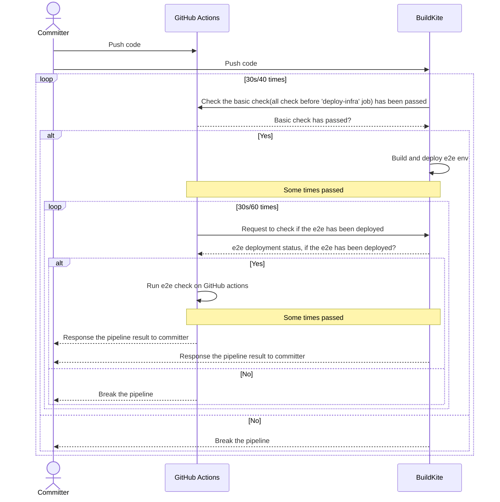

# Heartbeat Project

[](https://buildkite.com/heartbeat-backup/heartbeat)[](https://www.codacy.com/gh/au-heartbeat/HeartBeat/dashboard?utm_source=github.com&utm_medium=referral&utm_content=au-heartbeat/HeartBeat&utm_campaign=Badge_Grade)[](https://www.codacy.com/gh/au-heartbeat/HeartBeat/dashboard?utm_source=github.com&utm_medium=referral&utm_content=au-heartbeat/HeartBeat&utm_campaign=Badge_Coverage)

[](https://sonarcloud.io/summary/new_code?id=au-heartbeat-heartbeat-frontend)
[](https://sonarcloud.io/summary/new_code?id=au-heartbeat-heartbeat-frontend)
[](https://sonarcloud.io/summary/new_code?id=au-heartbeat-heartbeat-backend)

[](https://github.com/au-heartbeat/HeartBeat/actions/workflows/Docs.yaml) [](https://github.com/au-heartbeat/Heartbeat/actions/workflows/build-and-deploy.yml)

[](https://opensource.org/licenses/MIT)

[](https://app.fossa.com/projects/custom%2B23211%2Fgithub.com%2Fau-heartbeat%2FHeartbeat?ref=badge_large)

- [Heartbeat Project](#heartbeat-project)
- [News](#news)
- [1 About Heartbeat](#1-about-heartbeat)
- [2 Support tools](#2-support-tools)
- [3 Product Features](#3-product-features)
  - [3.1 Config project info](#31-config-project-info)
    - [3.1.1 Config Board/Pipeline/Source data](#311-config-boardpipelinesource-data)
      - [3.1.2 Config search data](#312-config-search-data)
        - [3.1.2.1 Date picker validation rules](#3121-date-picker-validation-rules)
      - [3.1.3 Config project account](#313-config-project-account)
        - [3.1.3.1 Guideline for generating Jira token](#3131-guideline-for-generating-jira-token)
        - [3.1.3.2 Guideline for generating Buildkite token](#3132-guideline-for-generating-buildkite-token)
        - [3.1.3.3 Guideline for generating GitHub token](#3133-guideline-for-generating-github-token)
        - [3.1.3.4 Authorize GitHub token with correct organization](#3134-authorize-github-token-with-correct-organization)
    - [3.2 Config Metrics data](#32-config-metrics-data)
      - [3.2.1 Config Crews/Board Mappings](#321-config-crewsboard-mappings)
      - [3.2.2 Setting Classification](#322-setting-classification)
      - [3.2.3 Rework times Setting](#323-rework-times-setting)
      - [3.2.4 Setting advanced Setting](#324-setting-advanced-setting)
      - [3.2.5 Pipeline configuration](#325-pipeline-configuration)
  - [3.3 Export and import config info](#33-export-and-import-config-info)
    - [3.3.1 Export Config Json File](#331-export-config-json-file)
    - [3.3.2 Import Config Json File](#332-import-config-json-file)
  - [3.4 Generate Metrics report](#34-generate-metrics-report)
    - [3.4.1 Velocity](#341-velocity)
    - [3.4.2 Cycle Time](#342-cycle-time)
    - [3.4.3 Classification](#343-classification)
    - [3.4.4 Rework](#344-rework)
    - [3.4.5 Deployment Frequency](#345-deployment-frequency)
    - [3.4.6 Lead time for changes Data](#346-lead-time-for-changes-data)
    - [3.4.7 Dev Change Failure Rate](#347-dev-change-failure-rate)
    - [3.4.8 Dev Mean time to recovery](#348-dev-mean-time-to-recovery)
  - [3.5 Export original data](#35-export-original-data)
    - [3.5.1 Export board data](#351-export-board-data)
      - [3.5.1.1 Done card exporting](#3511-done-card-exporting)
      - [3.5.1.1 Undone card exporting](#3511-undone-card-exporting)
    - [3.5.2 Export pipeline data](#352-export-pipeline-data)
  - [3.6 Caching data](#36-caching-data)
- [4 Known issues](#4-known-issues)
  - [4.1  Change status name in Jira board setting when there are cards in this status](#41--change-status-name-in-jira-board-setting-when-there-are-cards-in-this-status)
- [5 Instructions](#5-instructions)
  - [5.1 Prepare for Jira Project](#51-prepare-for-jira-project)
  - [5.2 Prepare env to use Heartbeat tool](#52-prepare-env-to-use-heartbeat-tool)
- [6 Run Heartbeat](#6-run-heartbeat)
  - [6.1 How to run frontend](#61-how-to-run-frontend)
  - [6.1.1 How to build and local preview](#611-how-to-build-and-local-preview)
  - [6.1.2 How to run unit tests](#612-how-to-run-unit-tests)
  - [6.1.3 How to generate a test report](#613-how-to-generate-a-test-report)
  - [6.1.4 How to run E2E tests locally](#614-how-to-run-e2e-tests-locally)
  - [6.2 How to run backend](#62-how-to-run-backend)
- [7 How to trigger BuildKite Pipeline](#7-how-to-trigger-buildkite-pipeline)
  - [Release](#release)
    - [Release command in main branch](#release-command-in-main-branch)
- [8 How to use](#8-how-to-use)
  - [8.1 Docker-compose](#81-docker-compose)
    - [8.1.1 Customize story point field in Jira](#811-customize-story-point-field-in-jira)
    - [8.1.2 Multiple instance deployment](#812-multiple-instance-deployment)
  - [8.2 K8S](#82-k8s)
    - [8.2.1 Multiple instance deployment](#821-multiple-instance-deployment)
- [9 Contribution](#9-contribution)
- [10 Pipeline Strategy](#10-pipeline-strategy)

# News

- [Feb 28 2023 - Released Heartbeat - 0.9.0](release-notes/20230228.md)
- [July 27 2023 - Release Heartbeat - 1.0.0](release-notes/20230726.md)
- [Oct 9 2023 - Release Heartbeat - 1.1.0](release-notes/20231009.md)
- [Nov 6 2023 - Release Heartbeat - 1.1.2](release-notes/20231106.md)
- [Nov 21 2023 - Release Heartbeat - 1.1.3](release-notes/20231121.md)
- [Dev 4 2023 - Release Heartbeat - 1.1.4](release-notes/20231204.md)
- [Feb 29 2024 - Release Heartbeat - 1.1.5](release-notes/20240229.md)
- [Apr 2 2024 - Release heartbeat - 1.1.6](release-notes/20240402.md)

# 1 About Heartbeat

Heartbeat is a tool for tracking project delivery metrics that can help you get a better understanding of delivery performance. This product allows you easily get all aspects of source data faster and more accurate to analyze team delivery performance which enables delivery teams and team leaders focusing on driving continuous improvement and enhancing team productivity and efficiency.

State of DevOps Report is launching in 2019. In this webinar, The 4 key metrics research team and Google Cloud share key metrics to measure DevOps performance, measure the effectiveness of development and delivery practices. They searching about six years, developed four metrics that provide a high-level systems view of software delivery and performance.

**Below are the 8 metrics supported by heartbeat:**


1.  [Velocity](#341-velocity)
2.  [Cycle time](#341-velocity)
3.  [Classification](#343-classification)
4.  [Rework](#344-rework)
5.  [Deployment Frequency](#345-deployment-frequency) 
6.  [Lead Time for changes](#346-lead-time-for-changes-data)
7.  [Change Failure Rate](#347-dev-change-failure-rate)
8.  [Mean Time To Recover](#348-dev-mean-time-to-recovery)


# 2 Support tools

Here is the user manaul for Version 1 on 2020/06. For now, we just can support Jira/Buildkite/Github to generate the corresponding metrics data.
| Type | Board | Pipeline | Repo |
| ------------- | --------------------- | ---------------------------------------- | -------------------------- |
| Support tools | Jira √ </br> Trello × | Buildkite √ </br>Teamcity × </br> GoCD × | Github √ </br> Bitbucket × |

**Note：** “√” means can support, “×” means can not support

# 3 Product Features

## 3.1 Config project info

### 3.1.1 Config Board/Pipeline/Source data

Before generator the metrics data, user need to config the project info, in Home page (Image3-1), you can create a new project for your project, or you can import a project config json file (If you already saved one config file, for import file feature will introduce in “Import and Export feature ”).

\
_Image 3-1，home page_

#### 3.1.2 Config search data

If you are first use the product, you need to select “Create A New Project”，it will go to config page (Image 3-2)

\
_Image 3-2，Project config page_

Users need to select a period of time, then all of the data that follows is based on that time period.

**Have two items of time period:**

1.  **Regular Calendar(Weekend Considered):** If you select this item, it means all data will exclude the weekend.
2.  **Calendar with Chinese Holiday:** If you select this item, it means all data will exclude the weekend and Chinese holiday. So if the time period you selected contains Chinese holiday, you need to select this item.

All need to select which data you want to get, for now, we support seven metrics data (Image 3-3). Those seven metrics are `Deployment Frequency (DF)`, `Lead Time for changes (LTC)`, `Mean Time To Recover (MTTR)`, `Change Failure Rate (CFR)`, and `Velocity`, `Cycle time`, `Classification`, where

- `Velocity` : includes how many story points and cards we have completed within selected time period.
- `Cycle time`: the time it take for each card start to do until move to done.
- `Classification`: provide different dimensions to view how much efforts team spent within selected time period.

\
_Image 3-3，Metrics Data_

##### 3.1.2.1 Date picker validation rules

User can not select future time in calendar (both start time & end time). The max date interval between start time and end time is 31 days (e.g. 01/01/2024 - 01/31/2024).

Invalid dates may be, e.g. future dates, interval between start time and end time is more than 31 days, end time is before start time, etc.

If user selects and invalid date, a warning may be shown.

#### 3.1.3 Config project account

Because all metrics data from different tools that your projects use. Need to have the access to these tools then you can get the data. So after select time period and metrics data, then you need to input the config for different tools(Image 3-4).

According to your selected required data, you need to input account settings for the respective data source. Below is the mapping between your selected data to data source.

| Required Data         | Datasource     |
| --------------------- | -------------- |
| Velocity              | Board          |
| Cycle time            | Board          |
| Classification        | Board          |
| Rework times          | Board          |
| Lead time for changes | Repo，Pipeline |
| Deployment frequency  | Pipeline       |
| Change failure rate   | Pipeline       |
| Mean time to recovery | Pipeline       |

\
Image 3-4，Project config

**The details for board:**
|Items|Description|
|---|---|
|Board Type|Support two types of board: Classic Jira and Next-gen Jira|
|Board Id|The value of BoardId is number. You need to find it from your team’s Jira board URL.<br/>For Example: <br/> 1. Your jira board URL like below, then `2` is the boardId <br/> https://dorametrics.atlassian.net/jira/software/projects/ADM/boards/2 <br/> 2. Your jira board URL like below, then rapidView=3, `3` is the boardId <br/> https://pokergame.atlassian.net/secure/RapidBoard.jspa?projectKey=KAN1&useStoredSettings=true&rapidView=3 |
|ProjectKey|You can find it from your team’s Jira board URL. <br/> For Example: <br/> 1. Your jira board URL like below, then `ADM` is the projectkey <br/> https://dorametrics.atlassian.net/jira/software/projects/ADM/boards/2<br/> 2. Your jira board URL like below, then projectKey is `KAN1` <br/> https://pokergame.atlassian.net/secure/RapidBoard.jspa?projectKey=KAN1&useStoredSettings=true&rapidView=3 |
|Site|Site is the domain for your jira board, like below URL, `dorametrics` is the site <br/> https://dorametrics.atlassian.net/jira/software/projects/ADM/boards/2 |
|Email|The email can access to the Jira board |
|Token|Generate a new token with below link, https://id.atlassian.com/manage-profile/security/api-tokens |
##### 3.1.3.1 Guideline for generating Jira token

_Image 3-5, create Jira token_

**The details for Pipeline:**
|Items|Description|
|---|---|
|PipelineTool| The pipeline tool you team use, currently heartbeat only support buildkite|
|Token|Generate buildkite token with below link, https://buildkite.com/user/api-access-tokens|
##### 3.1.3.2 Guideline for generating Buildkite token
Select organization for you pipeline

Choose "Read Builds","Read Organizations" and "Read Pipelines".

_Image 3-6, generate Buildkite token_

**The details for SourceControl:**
|Items|Description|
|---|---|
|SourceControl|The source control tool you team use, currently heartbeat only support Github|
|Token|Generate Github token with below link(classic one), https://github.com/settings/tokens|
##### 3.1.3.3 Guideline for generating GitHub token
Generate new token (classic)

Select repo from scopes

_Image 3-7, generate classic GitHub token_
##### 3.1.3.4 Authorize GitHub token with correct organization

_Image 3-8, authorize GitHub token with correct organization_
### 3.2 Config Metrics data

After inputting the details info, users need to click the `Verify` button to verify if can access to these tool. Once verified, they could click the `Next` button go to next page -- Config Metrics page(Image 3-5，Image 3-6，Image 3-7)

#### 3.2.1 Config Crews/Board Mappings

\
_Image 3-9, Crews/Board Mappings config_

**Crew Settings:** You could select your team members from a list get from board source. The list will include the assignees for those tickets that finished in the time period selected in the last step.

**Cycle Time:** It will list all columns for the current active jira board. Then users need to map the each column to the supported columns. Like, if your board have “in progress” column, it means developer doing this ticket, so it should be mapping with “In Dev” for the list we provide.

| Status              | Description                                                                                                                            |
| ------------------- | -------------------------------------------------------------------------------------------------------------------------------------- |
| To do               | It means the ticket needs to be done, waiting for Dev to pick it. Cycle time doesn't include this time.                                |
| Analysis            | BA or other people still need to analyze the ticket. Cycle time doesn't include this time.                                             |
| In Dev              | It means dev is doing the ticket. This time should be a part of cycle time. And it is named development time.                          |
| Block               | It means the tickets blocked by some issues, cannot be done now. This time should be a part of cycle time. And it is named block time. |
| Waiting for testing | It means waiting for Dev to pick or QA to testing. This time should be a part of cycle time. And it is named waiting time.             |
| Testing             | It means QA is testing the tickets. This time should be a part of cycle time. And it is named testing time.                            |
| Review              | It means PO or other people are reviewing the tickets. This time should be a part of cycle time. And it is named review time.          |
| Done                | It means the tickets are already done. Cycle time doesn't include this time.                                                           |
| --                  | If you don't need to map, you can select --                                                                                            |

**By Status**: user can click the toggle selected button to choose the mapping relationship by column or by status. It support multiple status map in to one column, just as the picture shows the TODO and INPROGRESS board  status can be mapped to different heartbeat states.

\
_Image 3-10，By Status_

#### 3.2.2 Setting Classification

\
_Image 3-11，Classification Settings_

In classification settings, it will list all Context fields for your jira board. Users can select anyone to get the data for them. And according to your selection, in the export page, you will see the classification report to provide more insight with your board data.

#### 3.2.3 Rework times Setting
\
_Image 3-12，Rework times Settings_

In Rework times settings, it contains Rework to which state Input and Exclude which states(optional) Input. The options in the Rework to which state Input are all from Board mappings, the options are ordered, and when an option is selected, the rework information of the option and all subsequent options will be counted in the report page and export file. The Exclude which states(optional) Input can help you exclude certain subsequent options (image 3-7).

#### 3.2.4 Setting advanced Setting

\
_Image 3-13，advanced Settings_

In advanced settings, it contains story points Input and Flagged Input. Users can input story points and Flagged custom-field on their own when the jira board has permission restriction . And according to these input, in the export page, user can get correct story points and block days

how to find the story points and Flagged custom-field?

\
_Image 3-14，devTool-network-part_

\
_Image 3-15，card-history_

\
_Image 3-16，find-custom-field-api_

\
_Image 3-17，story-point-custom-field_

\
_Image 3-18，flagged-custom-field_

1. user need to go to the jira board and click one card , then open dev tool switch to network part. 
2. then click card's history part. 
3. at that time, user can see one api call which headers request URL is https://xxx.atlassian.net/rest/gira/1/ . 
4. then go to review part, find fieldDisplayName which show Flagged and story point estimate and get the fieldId as the custom-field that user need to input in advanced settings. from image 3-13 and 3-14 we can find that  flagged custom field is customfield_10021, story points custom field is customfield_10016. 

#### 3.2.5 Pipeline configuration

\
_Image 3-19，Settings for Pipeline_

They are sharing the similar settings which you need to specify the pipeline step so that Heartbeat will know in which pipeline and step, team consider it as deploy to PROD. So that we could use it to calculate metrics.

| Items         | Description                                       |
| ------------- --|----------------------------------------------------------------- |
| Organization  | The organization for your pipelines               |
| Pipeline Name | Your pipeline name                                |
| Steps         | The pipeline step that consider as deploy to PROD || Branches      | Your selected branches                            |

## 3.3 Export and import config info

### 3.3.1 Export Config Json File

When user first use this tool, need to create a project, and do some config. To avoid the user entering configuration information repeatedly every time, we provide a “Save” button in the config and metrics pages. In config page, click the save button, it will save all items in config page in a Json file. If you click the save button in the metrics page, it will save all items in config and metrics settings in a Json file. Here is the json file (Image 3-16)。Note: Below screenshot just contains a part of data.

\
_Image 3-20, Config Json file_

### 3.3.2 Import Config Json File

When user already saved config file before, then you don’t need to create a new project. In the home page, can click Import Project from File button(Image 3-1) to select the config file. If your config file is too old, and the tool already have some new feature change, then if you import the config file, it will get some warning info(Image 3-17). You need to re-select some info, then go to the next page.

\
_Image 3-21, Warning message_

## 3.4 Generate Metrics report

After setup and configuration, then it will generate the heartbeat dashboard.

_Image 3-22, Report page_

You could find the drill down from `show more >` link from dashboard.

### 3.4.1 Velocity

In Velocity Report, it will list the corresponding data by Story Point and the number of story tickets. (image 3-19)
- `Velocity` : includes how many story points and cards we have completed within selected time period.
- Definition for 'Velocity(Story Point)‘: how many story point we have completed within selected time period.
- Formula for 'Velocity(Story Point): sum of story points for done cards in selected time period
- Definition for 'Throughput(Cards Count): how many story cards we have completed within selected time period.
- Formula for 'Throughput(Cards Count): sum of cards count for done cards in selected time period
  

\
_Image 3-23，Velocity Report_

### 3.4.2 Cycle Time

The calculation process data and final result of Cycle Time are calculated by rounding method, and two digits are kept after the decimal point. Such as: 3.567... Is 3.56; 3.564... Is 3.56.
- `Cycle time`: the time it take for each card start ‘to do’ until move to ‘done’.
- Definition for ‘Average Cycle Time(Days/SP)’: how many days does it take on average to complete a point?
- Formula for ‘Average Cycle Time(Days/SP)’: sum of cycle time for done cards/done cards story points
- Definition for ‘Average Cycle Time(Days/Card)’: how many days does it take on average to complete a card?
- Formula for ‘Average Cycle Time(Days/Card)’: sum of cycle time for done cards/done cards count

\
_Image 3-24，Cycle Time Report_

### 3.4.3 Classification

It will show the classification data of Board based on your selection on `Classification Settings` in metrics page.
The percentage value represent the count of that type tickets vs total count of tickets.
- `Classification`: provide different dimensions to view how much efforts team spent within selected time period.
- for example: spike cards account for 17.65% of the total completed cards

\
_Image 3-25，Classification Report_

### 3.4.4 Rework

- Definition for ‘Rework': cards roll back from a later state to a previous state, for example, one card move from 'testing' state to 'in dev' state, which means this card is reworked.
- Formula for 'Total rework times': the total number of rework times in all done cards
- Formula for 'Total rework cards': the total number of rework cards in all done cards
- Formula for 'Rework cards ratio': total rework cards/throughput

It will show the rework data of board on your selection on `Rework times settins` in metrics page (image 3-21).

If "to do" is selected in the "Rework to which column", we will count the number of times the subsequent options in the options are reworked back to the "to do" state.


  
\
_Image 3-26，Rework Report_

### 3.4.5 Deployment Frequency
- Definition for ‘Deployment Frequency': this metrics records how often you deploy code to production on a daily basis.
- Formula for ‘Deployment Frequency': the umber of build for（Status = passed & Valid = true）/working days
\
_Image 3-27，export pipline data_
\
_Image 3-28，Deployment Frequency Report_

### 3.4.6 Lead time for changes Data
- Definition for ‘Lead time for changes': this metrics records the time from first code commit to code successfully running in production.
- Formula for ‘PR lead time':
-- if PR merge not null: PR lead time = PR merged time - code committed time
-- if PR merge is null: PR lead time = PR created time - code committed time
-- if no PR merge: PR lead time = 0
- Formula for ‘Pipeline lead time':
-- if PR merge not null: Pipeline lead time = Deployment Completed Time - PR merged time
-- if PR merge is null: Pipeline lead time = Deployment Completed Time - PR created time
-- if no PR merge: Pipeline lead time = 0

\
_Image 3-29，Lead time for changes Report_

### 3.4.7 Dev Change Failure Rate
- Definition for ‘Dev Change Failure Rate': this metrics is different from the official definition of change failure rate, in heartbeat, we definite this metrics based on development，which is the percentage of failed pipelines in the total pipelines, and you chan select different pipeline as your final step,and this value is lower means failed pipeline is fewer.
- Formula for ‘Dev Change Failure Rate': the number of build for (Status = failed)/the number of build for [（Status = passed & Valid = true）+ the number of build for (status=failed)]

\
_Image 3-30，Change Failure Rate Report_

### 3.4.8 Dev Mean time to recovery
- Definition for ‘Dev Mean time to recovery': this metrics alse defined based on development, it records how long it generally takes to restore when pipeline failed, and If this value is less than 8 hours, it means ‘red does not last overnight’, which means our repair speed is relatively good.
- Formula for ‘Dev Mean time to recovery': sum[he time difference from the first fail to the first pass for deployment completed time]/ the number of repairs

\
_Image 3-31，mean time to recovery 

## 3.5 Export original data

After generating the report, you can export the original data for your board and pipeline (Image 3-18). Users can click the “Export board data” or “Export pipeline data” button to export the original data.

### 3.5.1 Export board data

It will export a csv file for board data

#### 3.5.1.1 Done card exporting

Export the all done tickets during the time period(Image 3-18)

#### 3.5.1.1 Undone card exporting

Export the latest updated 50 non-done tickets in your current active board. And it will order by heartbeat state and then last status change date(Image 3-28)

\
_Image 3-32，Exported Board Data_

**All columns for Jira board:**
|Column name |Description|
|---|---|
|Issue key|Ticket ID|
|Summary|--|
|Issue Type|-- |
|Status|--|
|Story Point|--|
|Assignee|--|
|Reporter|--|
|Project Key|--|
|Project Name|--|
|Priority|--|
|Parent Summary|The epic for ticket|
|Sprint|Which sprint this ticket in |
|Labels|--|
|Cycle Time|total Cycle Time|
|Cycle Time / Story Points|Cycle Time for each point|
|Analysis Days|Analysis days for each ticket|
|In Dev Days|Development days for each ticket |
|Waiting Days|After development, how long will take before testing|
|Testing Days|Testing days for each ticket |
|Block Days|Blocked days for each ticket|
|Review Days|--|
|Original Cycle Time: {Column Name}|The data for Jira board original data |
|Rework: total - {rework state} | The total number of rework times |
|Rework: from {subsequent status} | The number of rework times |
### 3.5.2 Export pipeline data

It will export a csv file for pipeline data (image 3-29).

\
_Image 3-33，Exported Pipeline Data_

**All columns for pipeline data:**
|Column name |Description|
|---|---|
|Pipeline Name|--|
|Pipeline Step|Step name |
|Committer|--|
|Code Committed Time|Committed time |
|PR Created Time|-- |
|PR Merged Time|-- |
|Deployment Completed Time|When it finished deploy |
|Total Lead Time (mins)|--|
|PR lead time (mins)|--|
|Pipeline lead time (mins)|--|
|Status|Status for pipeline (Pass or Failed)|

## 3.6 Caching data

In HeartBeat tool design, we have a cache setting for verify jira & pipeLine & gitHub config function and pipleLine loading function and generate report function.

- `For Jira/Buildkite/Github data`: TTL for cache -> 90 seconds
- `For holiday data`:TTL for cache -> 5 minutes

# 4 Known issues

## 4.1  Change status name in Jira board setting when there are cards in this status
As an administrator of the jira board, if you modify the workflow to change the status name, it will affect the calculation of duration for cards in that status. Considering the potential loss of duration, changing the status name can lead to loss of precision in cycle time calculation for related cards.

# 5 Instructions

## 5.1 Prepare for Jira Project

For Classic Jira users, before you use this tool, you need to do some settings for the jira board. Otherwise, you cannot get the data. Here are the steps you need to do:

1.  Open https://{site}.atlassian.net/secure/admin/ViewIssueFields.jspa?start=0&searchFilter=
    \
    _Image 5-1_

2.  You need to enable any items you want to know. In the above page, If you want to change any items' screens, you can click the screens link in the actions column for that item. Then in the next page, check the project you want to change, and update it. Like: Story points

- \
  _Image 5-2_

- \
  _Image 5-3_

For the next-gen Jira, when you add story points item, the name should be Story Points or Story point estimate.

## 5.2 Prepare env to use Heartbeat tool

For now, we just can download the code in our local machine, please follow below steps:

1.  Clone the backend code in your local machine: https://github.com/thoughtworks/HeartBeat/
2.  Follow the steps as below

# 6 Run Heartbeat

## 6.1 How to run frontend

```
cd HearBeat/frontend
pnpm install
pnpm start
```

## 6.1.1 How to build and local preview

```
pnpm build
pnpm preview
```

## 6.1.2 How to run unit tests

```
pnpm test
```

## 6.1.3 How to generate a test report

```
pnpm coverage
```

## 6.1.4 How to run E2E tests locally

2. Start the backend service

```
cd HearBeat/backend
./gradlew bootRun --args='--spring.profiles.active=local'
```

3. Start the frontend service

```
cd HearBeat/frontend
pnpm start
```

4. Run the E2E tests

```
cd HearBeat/frontend
pnpm run e2e:headed
```
## 6.2 How to run backend
Refer to [run backend](backend/README.md#1-how-to-start-backend-application)

# 7 How to trigger BuildKite Pipeline

1. Add `[infra]` tag to the title of the commit message or PR to trigger infra-related deployments.

2. Add `[backend]` tag to the title of the commit message or PR to trigger backend-related deployments.

3. Add `[frontend]` tag to the title of the commit message or PR to trigger frontend-related deployments.

4. Add `[docs]` tag to the title of the commit message or PR to trigger docs-related deployments.

## Release

Release version follows **[Software release life cycle](https://en.wikipedia.org/wiki/Software_release_life_cycle)**

### Release command in main branch

```sh
git tag {tag name}
git push origin {tag name}

# Delete tag
git tag -d {tag name}
git push origin :refs/tags/{tag name}
```

# 8 How to use

## 8.1 Docker-compose

First, create a `docker-compose.yml` file, and copy below code into the file.

```yaml
version: "3.4"

services:
  backend:
    image: ghcr.io/au-heartbeat/heartbeat_backend:latest
    container_name: backend
    ports:
      - 4322:4322
    restart: always
  frontend:
    image: ghcr.io/au-heartbeat/heartbeat_frontend:latest
    container_name: frontend
    ports:
      - 4321:80
    depends_on:
      - backend
    restart: always
```

Then, execute this command

```sh
docker-compose up -d frontend
```

### 8.1.1 Customize story point field in Jira

Specifically, story point field can be indicated in `docker-compose.yml`. You can do it as below.

```yaml
version: "3.4"
services:
  backend:
    image: ghcr.io/au-heartbeat/heartbeat_backend:latest
    container_name: backend
    ports:
      - 4322:4322
    restart: always
    environment:
      STORY_POINT_KEY: customfield_10061
  frontend:
    image: ghcr.io/au-heartbeat/heartbeat_frontend:latest
    container_name: frontend
    ports:
      - 4321:80
    depends_on:
      - backend
    restart: always
```

### 8.1.2 Multiple instance deployment

Specifically, if you want to run with multiple instances. You can do it with below docker compose file.

You can change `deploy.replicas` to adjust the number of instances.

```yaml
version: "3.4"

services:
  backend:
    image: ghcr.io/au-heartbeat/heartbeat_backend:latest
    expose:
      - 4322
    deploy:
      replicas: 3
    restart: always
    volumes:
      - file_volume:/app/output
  frontend:
    image: ghcr.io/au-heartbeat/heartbeat_frontend:latest
    container_name: frontend
    ports:
      - 4321:80
    depends_on:
      - backend
    restart: always
volumes:
  file_volume:
```

## 8.2 K8S

First, create a `k8s-heartbeat.yml` file, and copy below code into the file.

```yaml
apiVersion: apps/v1
kind: Deployment
metadata:
  name: backend
spec:
  selector:
    matchLabels:
      app: backend
  template:
    metadata:
      labels:
        app: backend
    spec:
      containers:
        - name: backend
          image: ghcr.io/au-heartbeat/heartbeat_backend:latest
---
apiVersion: v1
kind: Service
metadata:
  name: backend
spec:
  selector:
    app: backend
  ports:
    - protocol: TCP
      port: 4322
      targetPort: 4322
  type: LoadBalancer
---
apiVersion: apps/v1
kind: Deployment
metadata:
  name: frontend
spec:
  selector:
    matchLabels:
      app: frontend
  template:
    metadata:
      labels:
        app: frontend
    spec:
      containers:
        - name: frontend
          image: ghcr.io/au-heartbeat/heartbeat_frontend:latest
---
apiVersion: v1
kind: Service
metadata:
  name: **frontend**
spec:
  selector:
    app: frontend
  ports:
    - protocol: TCP
      port: 4321
      targetPort: 80
  type: LoadBalancer
```

Then, execute this command

```sh
kubectl apply -f k8s-heartbeat.yml
```

### 8.2.1 Multiple instance deployment

You also can deploy Heartbeats in multiple instances using K8S through the following [documentation](https://au-heartbeat.github.io/Heartbeat/en/devops/how-to-deploy-heartbeat-in-multiple-instances-by-k8s/).

# 9 Contribution

We love your input! Please see our [contributing guide](contribution.md) to get started. Thank you 🙏 to all our contributors!

# 10 Pipeline Strategy

Now, Heartbeat uses `GitHub Actions` and `BuildKite` to build and deploy Heartbeat application. 

But there is some constrains, like some pipeline dependency. 

So, committer should pay attention to this flow when there is some pipeline issues. 


