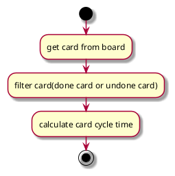
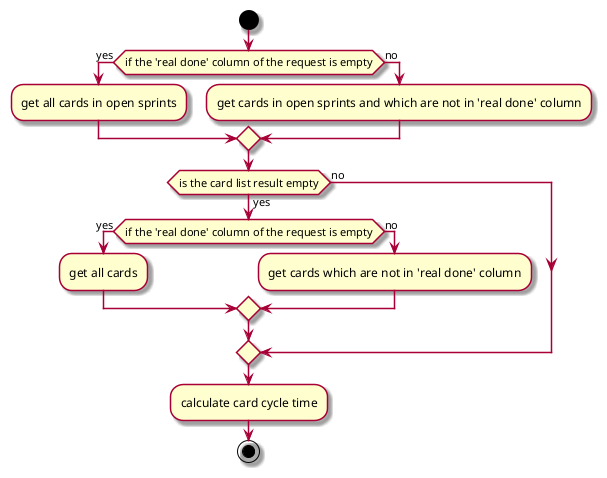
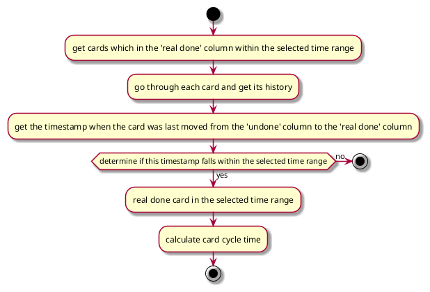

## General process



### Remark
When we calculate the relevant card data, we round each number after obtaining the data,
following the method of rounding down for numbers below .5 and rounding up for numbers .5 and above.
These values are then added together. This approach differs from adding the values first and then rounding,
and is done to maintain the accuracy of the precision.

## Undone card

### Definition

- **In current open sprint and status not in real done status.**

> example:
>
> Real done columns: **'Testing' and 'Done'**
>
> - card A in 'In Dev' column
> - card B in 'Review' column
> - card C in 'Testing' column
>
> Result: card A and B are undone cards

### Flow chart



### JQL to get undone cards

```java
private JiraCardWithFields getAllNonDoneCardsForActiveSprint(URI baseUrl, List<String> status, BoardRequestParam boardRequestParam) {
    String jql;
    if (status.isEmpty()) {
        jql = "sprint in openSprints() ";
    }
    else {
        jql = "sprint in openSprints() AND status not in ('" + String.join("','", status) + "')";
    }

    return getCardList(baseUrl, boardRequestParam, jql, "nonDone");
}
```

---

## Done card

### Definition

- **The earliest time move to real done column is in the date range user selected**

> example:
>
> selected date range: **2023.8.7 ~ 2023.8.20**
>
> Real done columns: **'Testing' and 'Done'**
>
> - card A moved to 'Testing' column in 2023.8.6 and moved 'Done' column in 2023.8.9
> - card B moved to 'Testing' column in 2023.8.8 and moved 'Done' column in 2023.8.10
> - card C moved to 'Testing' column in 2023.8.15
> - card D moved to 'Testing' column in 2023.8.21
>
> Result: card B and C are done cards

### Flow chart



### JQL to get done cards

```java
private String parseJiraJql(BoardType boardType, List<String> doneColumns, BoardRequestParam boardRequestParam) {
    if (boardType == BoardType.JIRA) {
    	return String.format("status in ('%s') AND status changed during (%s, %s)", String.join("','", doneColumns),
    			boardRequestParam.getStartTime(), boardRequestParam.getEndTime());
    }
    else {
    	StringBuilder subJql = new StringBuilder();
    	for (int index = 0; index < doneColumns.size() - 1; index++) {
    		subJql.append(String.format("status changed to '%s' during (%s, %s) or ", doneColumns.get(index),
    				boardRequestParam.getStartTime(), boardRequestParam.getEndTime()));
    	}
    	subJql
    		.append(String.format("status changed to '%s' during (%s, %s)", doneColumns.get(doneColumns.size() - 1),
    				boardRequestParam.getStartTime(), boardRequestParam.getEndTime()));
    	return String.format("status in ('%s') AND (%s)", String.join("', '", doneColumns), subJql);
    }
}
```

### Filter done card belonged to selected date range

1. Get done card histories;
2. Filter histories about status changed;
3. Filter status changed to real done statuses;
4. Get the timestamps moved to real done statuses;
5. Compare timestamps with selected date range to check whether it belongs to this range;

---

## OriginCycleTime implementation of export board data

- **<div style="background-color: #FFE669; width: 100px; height: 25px;text-align: center;display: inline-block;">flag</div>**: OriginCycleTime：`FLAG`
- **<div style="background-color: #FBE5D6; width: 100px; height: 25px;text-align: center;display: inline-block">block</div>**: OriginCycleTime：`BLOCK`
- **<span style="color: green;">---green line---</span>**: `Block days` when Set Consider the "Flag" as "Block" is `False`
- **<span style="color: purple;">---purple line---</span>**: `Block days` when Set Consider the "Flag" as "Block" is `True`
- **⚠️** When calculating the time for the non-realdone column, subtract the flag duration if this column is flagged and Consider the "Flag" as "Block" is True

### Scenarios

| Number | Description                                                                            | Timeline diagram                                                                                                             | Block Days (Consider the "Flag" as "Block" is `True`)                                                                             | Block Days (Consider the "Flag" as "Block" is `False`) |
| :----- | :------------------------------------------------------------------------------------- | :--------------------------------------------------------------------------------------------------------------------------- | :-------------------------------------------------------------------------------------------------------------------------------- | ------------------------------------------------------ |
| 1      | Move to Block column after flag duration                                               |                 | Time between `Add flag` and `Remove flag` + Time in `block` column                                                                | Time in `block` column                                 |
| 2      | Move out Block column before flag duration                                             |                | Time between `Add flag` and `Remove flag` + Time in `block` column                                                                | Time in `block` column                                 |
| 3      | Block column duration within flag duration                                             |                | Time between `Add flag` and `Remove flag`                                                                                         | Time in `block` column                                 |
| 4      | Flag duration within Block duration                                                    |                | Time in `block` column                                                                                                            | Time in `block` column                                 |
| 5      | Block duration partial cross flag duration and block start time before flag start time |  | Time between `Add flag` and `Remove flag` + Time in `block` column - Overlap time                                                 | Time in `block` column                                 |
| 6      | Block duration partial cross flag duration and block end time after flag end time      |   | Time between `Add flag` and `Remove flag` + Time in `block` column - Overlap time                                                 | Time in `block` column                                 |
| 7      | Flag duration partial cross realDone duration                                          |          | Time between `Add flag` and `Remove flag` + Time in `block` column - `flag` and `block` cross time - `flag` and `done` cross time | Time in `block` column                                 |
