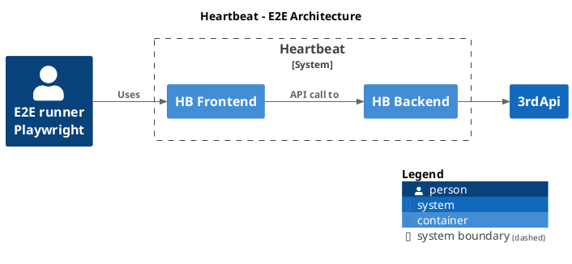

## E2E Overview
We currently use Playwright as the testing framework for E2E testing. In order to ensure the credibility of the test, we no longer use stub/mock 3rd services, but directly test against 3rd services.


## What is Playwright?
Playwright is an open-source automation library for browser testing and web scraping developed by Microsoft. It provides a high-level API for automating browsers such as Chrome, Firefox, and WebKit. It's similar to other tools like Puppeteer but offers cross-browser support and additional features like being able to test on multiple browsers in parallel.

## Why Playwright?
🔄 We decided to switch from Cypress to Playwright, mainly considering the following: 

1. **Cross-browser testing:** Playwright supports multiple browsers like Chrome, Firefox, and WebKit, making it easier to test the web application's compatibility across different browsers. Cypress primarily supports Chrome, although there are efforts to add support for other browsers as well.

2. **Parallel testing:** Playwright allows for running tests in parallel across multiple browser instances, which can significantly reduce test execution time. This is particularly valuable when dealing with a large number of tests in a test suite.

3. **Better automation capabilities:** Playwright provides more automation capabilities compared to Cypress, such as downloads automation, geolocation simulation, and network request interception. It offers more flexibility in how tests are written and executed.

4. **Faster execution:** Playwright is known for its faster test execution speed due to its efficient architecture and features like the ability to interact with elements without the need for waiting timers.

5. **Community and support:** Playwright is developed and maintained by Microsoft, which has a strong reputation in the software development industry. This can instill confidence in teams regarding the tool's long-term maintenance and support.

In addition, playwright has some advantages for developers:

1. **Programming language support:** Playwright supports multiple languages such as JavaScript, TypeScript, Python, and C#, providing more options for writing tests in a language preferred by the team. This allows developers to leverage their existing skills and knowledge.

2. **Asynchronous handling:** Playwright uses a more traditional async/await syntax for handling asynchronous operations, which can be more familiar to developers who are used to working with promises and async/await in modern JavaScript. But Cypress actually returned something only pretending to be a Promise.

3. **Page object model:** Playwright provides better support for the page object model, allowing for a more organized and maintainable test structure by separating page interactions into reusable components.

4. **Debugging capabilities:** Playwright offers better debugging capabilities, such as the ability to pause and inspect the state of the application during test execution, making it easier to troubleshoot issues and write reliable tests.

5. **Reporter:** Playwright's HTML reporter produces a self-contained folder that contains report for the test run that can be served as a web page. It's easy to read and retrace errors than Cypress.

## E2E file structure
```sh
e2e
├── fixtures
├── pages
├── reports
├── specs
├── temp
├── test-results
└── utils
```
- `fixtures`: This directory contain test fixtures or data used in the E2E tests, such as sample data, expect result, and [Playwright fixtures](https://playwright.dev/docs/test-fixtures).

- `pages`: This directory typically includes page objects or modules that represent different pages of the application being tested. Page objects help in organizing and maintaining the code for interacting with specific pages. ref: [Playwright POM](https://playwright.dev/docs/pom)

- `reports`: This directory store the generated test reports or logs after running the E2E tests, which provide insights into the test results, failures, and performance metrics.

- `specs`: This directory contains the test specifications or scenarios that reflect the [E2E Test Case Summary](https://docs.google.com/spreadsheets/d/1vT5LnQb940HK12V0o0kZlWI9SJwY03SqZHmZ11B9f9Q/edit?usp=sharing) cases.

- `temp`: This directory be used to store temporary files or data during the test execution. This folder is not defined by playwright, but specified by the programmer.

- `test-results`: The output directory for files created during test execution. This directory is cleaned at the start.

- `utils`: This directory  hold utility functions or helper modules that provide common functionalities used across the E2E tests.


## How to use in the local environment
The following command working within the directory: `/frontend`

### Initial setup
1. `pnpm install`
2. `pnpm exec playwright install --with-deps`
3. Create the `e2e/.env.local` by following the `e2e/.env.example`. For heartbeat dev, you could find the .env.example from [here](https://drive.google.com/file/d/1Q-HSJ-qvgvt8es2bWSIC2M891q5Xfcom/view?usp=drive_link).

### Run E2E testing with local env
- Run E2E (You should start FE&BE services firstly): `pnpm run e2e:local`
- Run E2E with FE&BE services: `pnpm run e2e:with-server`

### Serve HTML testing report
`pnpm run e2e:report PATH/TO/e2e-reports/html`


## Debugging tests
### Debug tests in UI mode
*Run E2E with debug UI*: `pnpm run e2e:ui`
It's highly recommend debugging your tests with UI Mode for a better developer experience where you can easily walk through each step of the test and visually see what was happening before, during and after each step. UI mode also comes with many other features such as the locator picker, watch mode and more.


### Debug tests with the Playwright Inspector
*Run E2E with debug Inspector*: `pnpm run e2e:debug`
The Playwright Inspector provides a user-friendly interface where you can view the DOM, inspect elements, debug JavaScript code, interact with the page, and understand the state of the application during test execution.


### Debug the pipeline E2E result with Playwright HTML report
- Download the report package from the pipeline build -> `🚀Run e2e` section -> Artifacts tab
- Unzip the report and run `pnpm run e2e:report PATH/TO/e2e-reports/html`

## How to generate screenshots
The pipeline run in the linux environment, so the screenshots are slightly different, so we need to use the macOS and docker container to generate a set of screenshots during development.

### Generate for macOS testing
`pnpm run e2e:updateSnapshots`

### Generate for pipeline testing
1. Build image for the first run: `pnpm run e2e:build-docker-image`
2. `pnpm run e2e:updateSnapshots-docker`

## How to add new testing env-var
If you need to add a new token or password to the test case, you should use the environment variable instead of plaintext to write it into the codebase.
1. Add env-var into `frontend/e2e/.env.local`
2. Add env-var sample into `frontend/e2e/.env.example`
3. Add env-var into `.github/workflows/build-and-deploy.yml` e2e section
4. Add env-var into `ops/check.sh` e2e_container_check function
5. For the pipeline, we currently use the Buildkite environment hook to inject environment variables
    - SSH into the Buildkite Agent EC2 server
    - Add env-var into `/etc/buildkite-agent/hooks/environment`

## How the pipeline run E2E testing
Due to permission issues with the Buildkite Agent EC2 server installation Playwright dependencies, we use docker images to run tests instead of native environment.

Pipeline config `.buildkite/pipeline.yml`:
```yaml
  - label: ":rocket: Run e2e"
    branches: main
    key: "check-e2e"
    depends_on:
      - "deploy-e2e"
      - "check-shell"
      - "check-security"
      - "check-frontend"
      - "check-px"
      - deny-css-rgba-check
      - deny-css-hex-check
      - "check-backend"
      - "check-frontend-license"
      - "check-backend-license"
    command: ./ops/check.sh e2e-container
    plugins:
      - artifacts#v1.9.0:
          upload: "./e2e-reports.tar.gz"
          expire_in: "${RETENTION_DAYS} days"
```

E2E runner script `./ops/check.sh`:
```shell
e2e_container_check() {
  docker build -t "heartbeat_e2e:latest" ./ -f ./ops/infra/Dockerfile.e2e

  set +e
  local result
  docker run \
    --name hb_e2e_runner \
    -e "APP_ORIGIN=${APP_HTTP_SCHEDULE:-}://${AWS_EC2_IP_E2E:-}:${AWS_EC2_IP_E2E_PORT:-}" \
    -e "E2E_TOKEN_JIRA=${E2E_TOKEN_JIRA:-}" \
    -e "E2E_TOKEN_BUILD_KITE=${E2E_TOKEN_BUILD_KITE:-}" \
    -e "E2E_TOKEN_GITHUB=${E2E_TOKEN_GITHUB:-}" \
    -e "CI=${CI:-}" \
    heartbeat_e2e:latest \
    pnpm run e2e:major-ci
  result=$?
  set -e

  docker cp hb_e2e_runner:/app/e2e/reports ./e2e-reports
  docker rm hb_e2e_runner
  tar -zcvf ./e2e-reports.tar.gz ./e2e-reports
  exit $result
}
```

## FAQ
### `Error: page.goto: net::ERR_CONNECTION_REFUSED at http://localhost:xxxx/`
Start your local FE and BE services firstly

### `Error: Failed to start E2E testing, please configure the env var APP_ORIGIN`
Please check if the `.env.local` file is configured

### I encountered some assertion errors in the test
- Please make sure that you have rebased the latest code and restarted the local FE and BE services
- Please check whether the token in env file is invalid
- If you modify the relevant code, please check whether it has broken the test
- If your want or need to modify the assertion or screenshot, you should align with BA instead of working silently
  - If the screenshot is incorrect, you need to update the screenshot of both macOS and linux

## Know issues
- In headed mode, screenshot comparison fails
- On the pipeline, the E2E docker image needs to be built every time
- Currently, we only test the Chrome browser locally and on the pipeline
