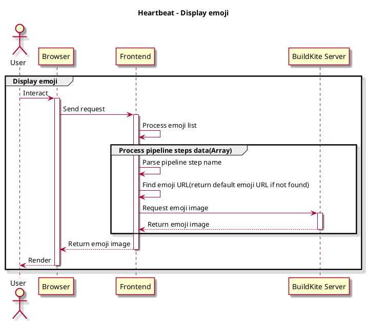

**Save the emoji resource in local.**

- Download the emoji list from an open source project: [BuildKite Emoji](https://cdn.jsdelivr.net/gh/buildkite/emojis@main/img-buildkite-64.json), [Apple Emoji](https://cdn.jsdelivr.net/gh/buildkite/emojis@main/img-apple-64.json)
- Remove unnecessary fields of the emoji json and keep the useful fields: `name`, `image`, `aliases`
- Concat this two emoji list
- Transform to one cleaned emoji list as we need to take name and aliases into consideration
- Find the corresponding emoji according to the name from the cleaned emoji list
- A default emoji will be displayed if we can't find one

## Display emoji

