## Calculate Velocity

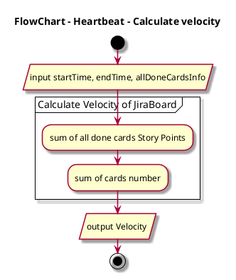

## Calculate Cycle Time

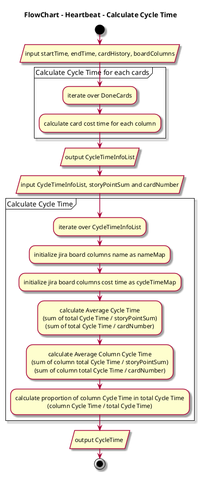

## Calculate Classification

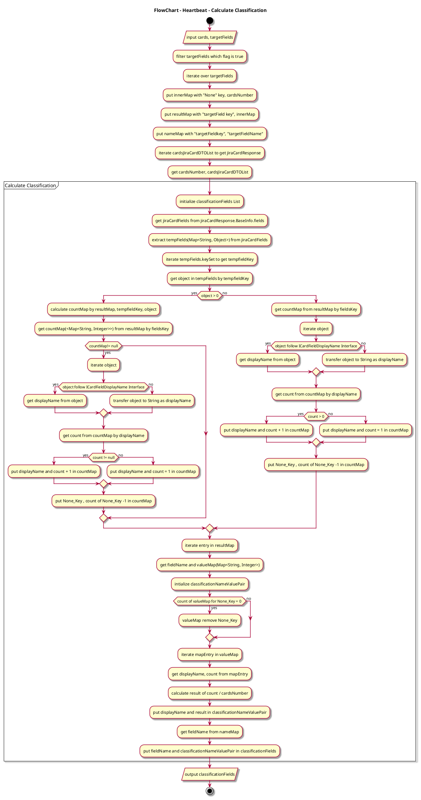

## Calculate Deployment Frequency

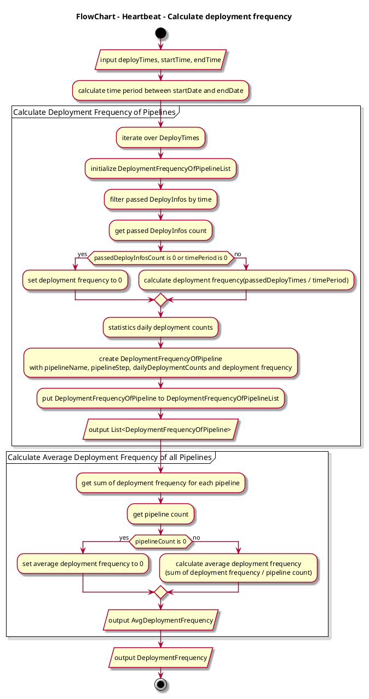

## Calculate Mean Time To Recovery

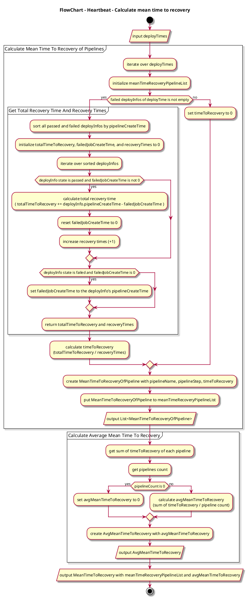

## Calculate Change Failure Rate

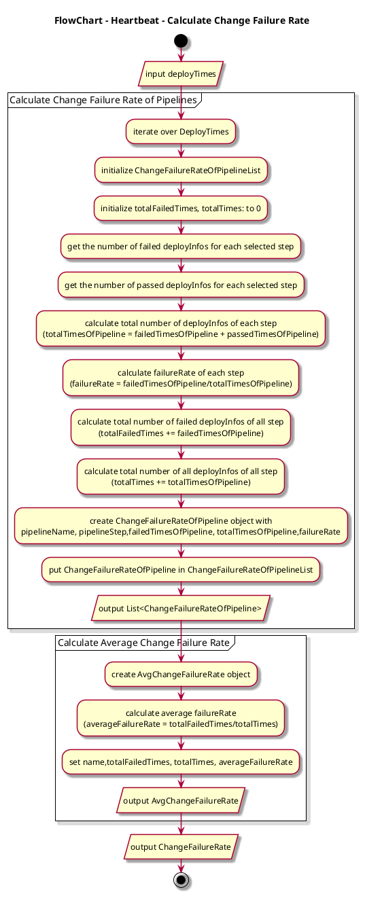

## Calculate LeadTime for Changes

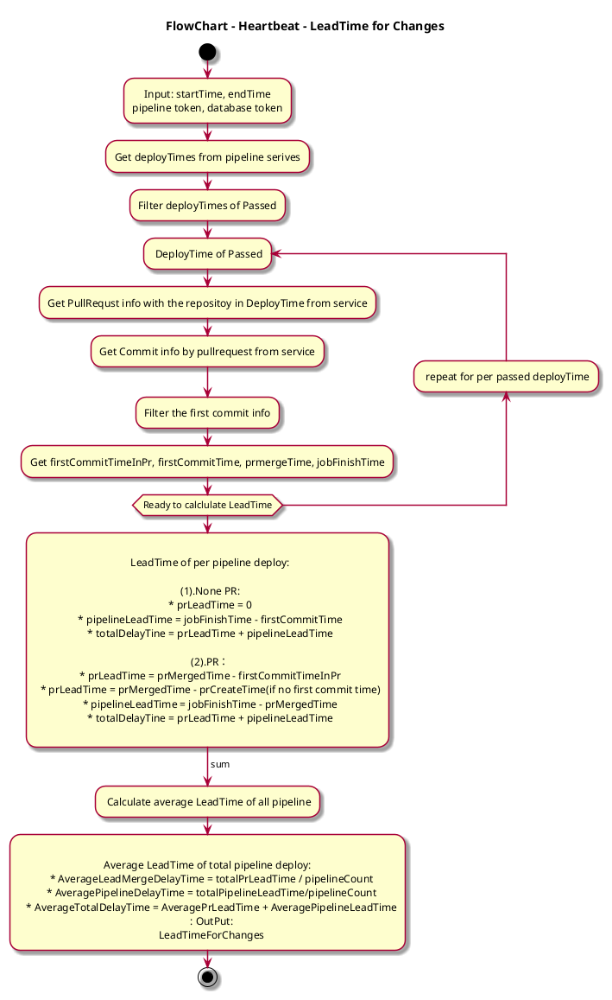

## Export Pipeline CSV

### Old app: Generate Pipeline CSV For LeadTime

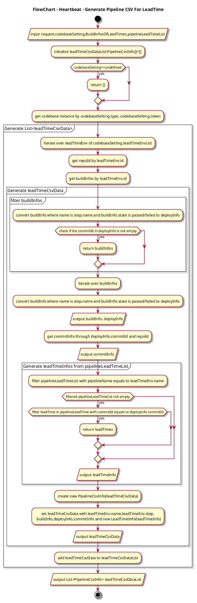

### Old app: Generate Pipeline CSV For BuildInfos

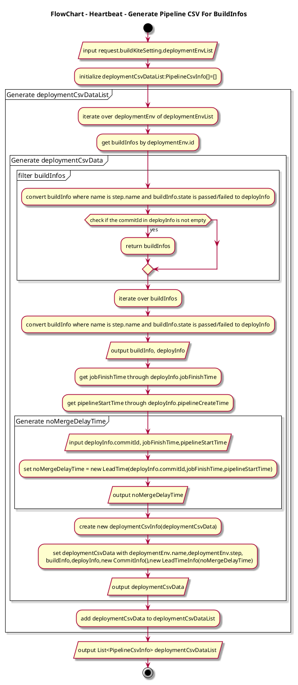

### Old app: Generate Pipeline CSV

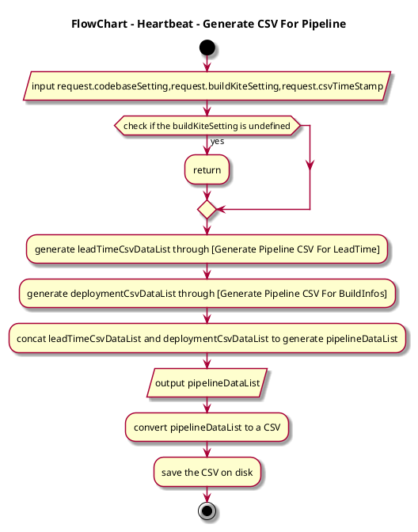

### New app: Generate Pipeline CSV For LeadTime

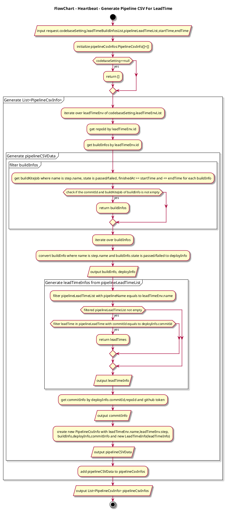

### New app: Generate Pipeline CSV For BuildInfos

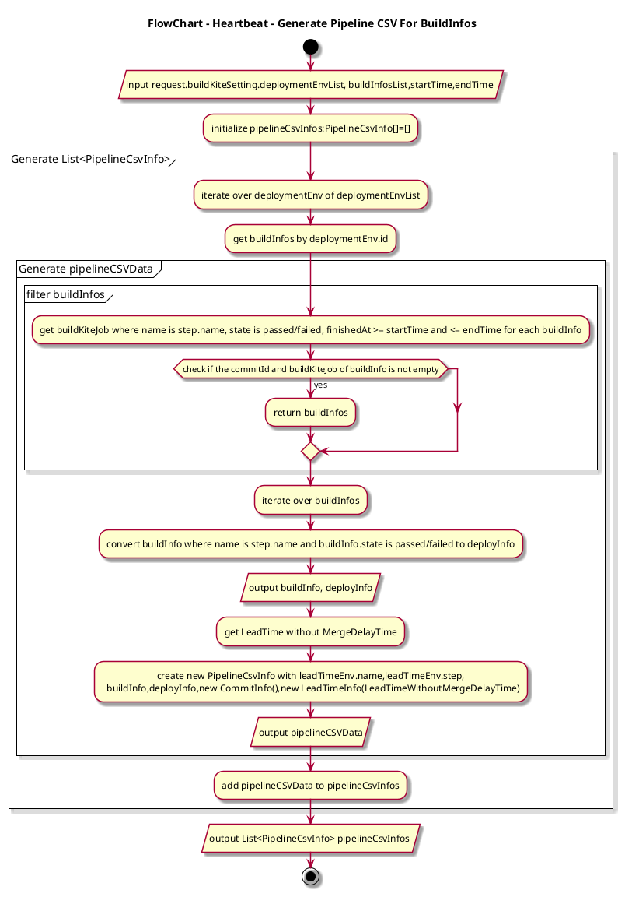

### New app: Generate Pipeline CSV

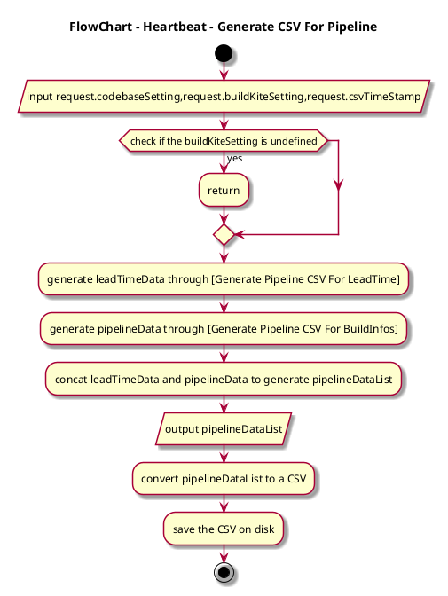

### Generate Board CSV

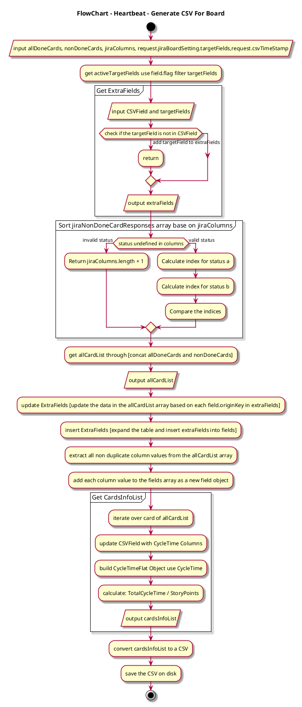
