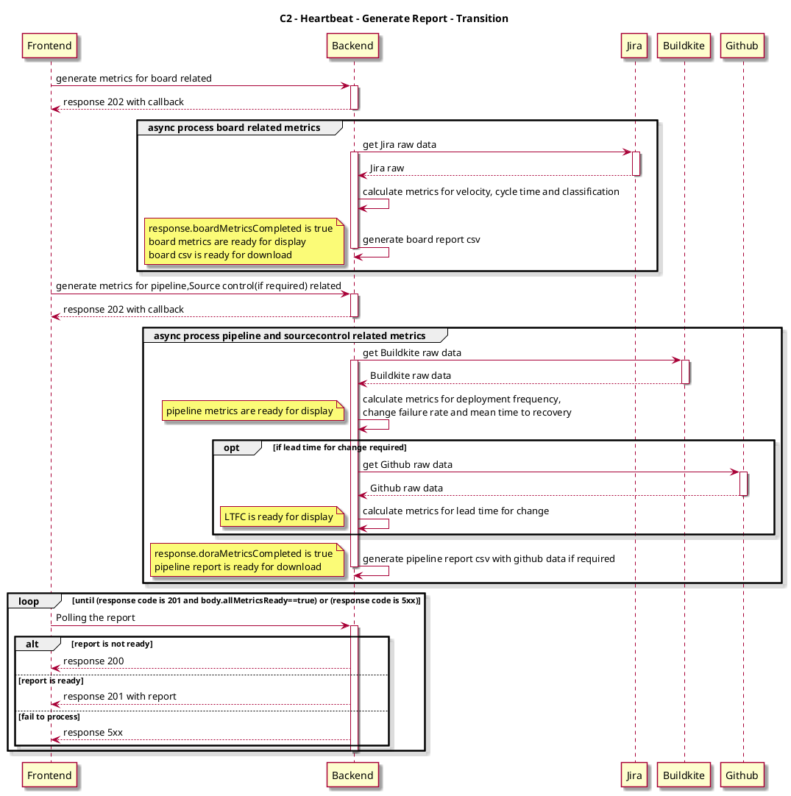
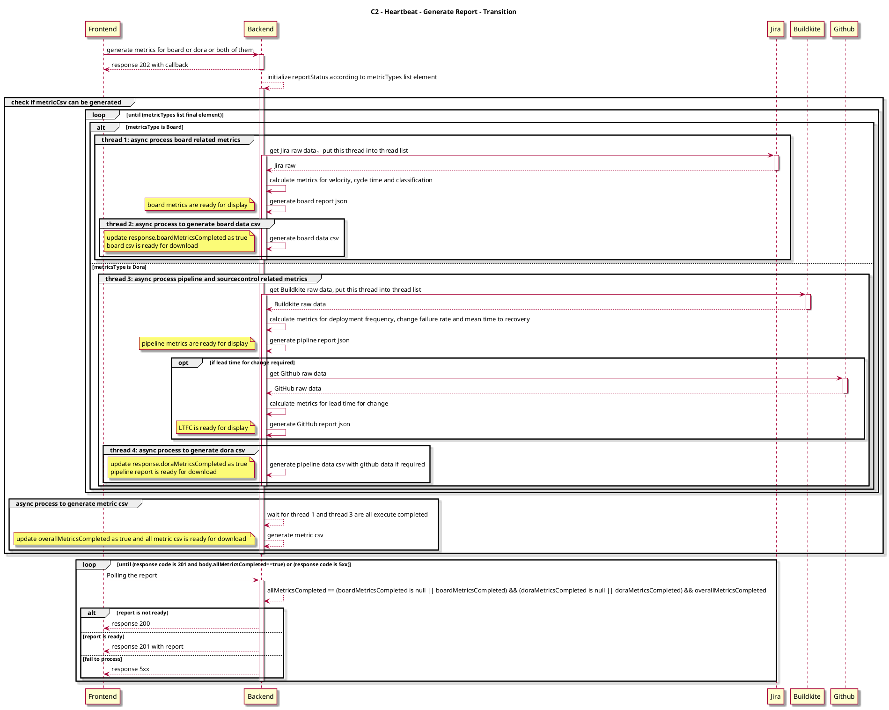

# Context
Considering to fix the issue about when one of the export button can not click but export metric button can click, and change logic about polling api in backend. we have to optimize generate report flow.

# Design
## C2 - Generate report - AS-IS

### Sequence Diagram



## C2 - Generate report - TO-BE
### Sequence Diagram




### API Design
the request body of generate report api is the same as as-is, but will add one parameter in the request body.
```
URI: POST /reports
Request payload:
{
   ...
   "metricTypes": [
        "string"
      ]
}
```

