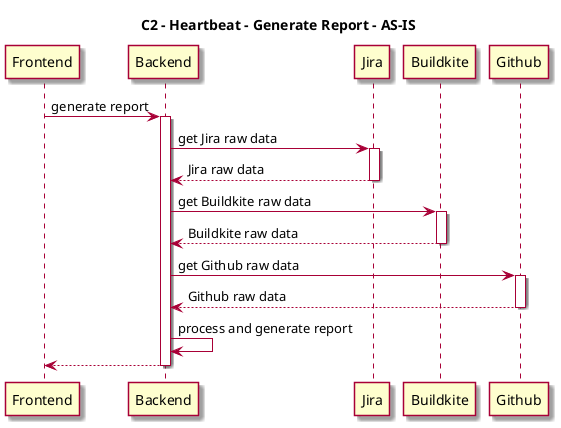
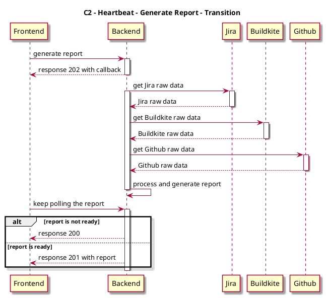
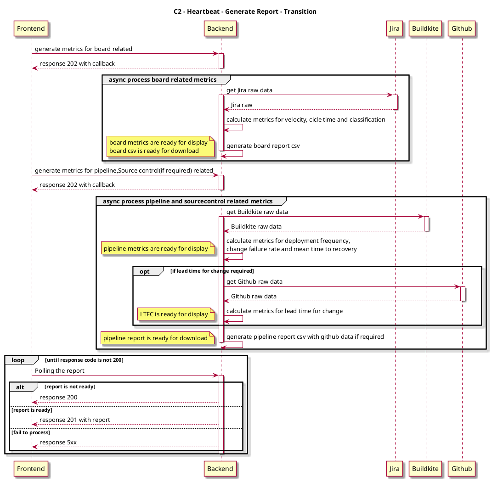

# Context
Considering there are some constrains that API call could not longer than 59 seconds from M Account, we have to re-fine our implementation by changing sync call to async. 

While it's not easy to make it at a once, we will do it step by step. Below are the design including C2 design with 
- AS-IS
- Transition
- TO-BE 

# Design
## C2 - Generate report - AS-IS

### Sequence Diagram

## C2 - Generate report - Transition
### Sequence Diagram

### API Design

## C2 - Generate report - TO-BE
### Sequence Diagram

### API Design
