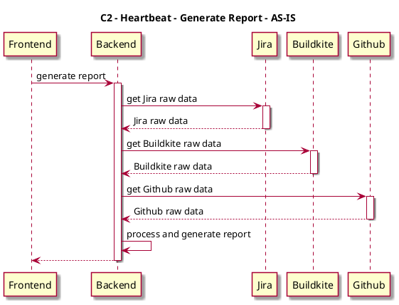
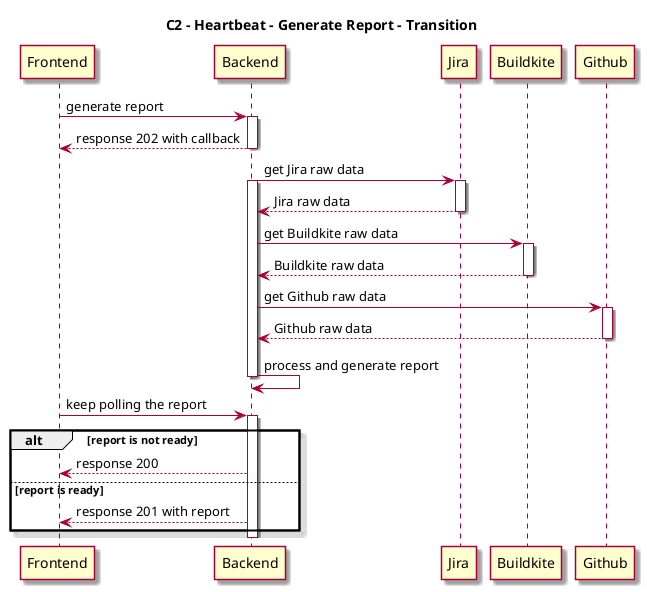
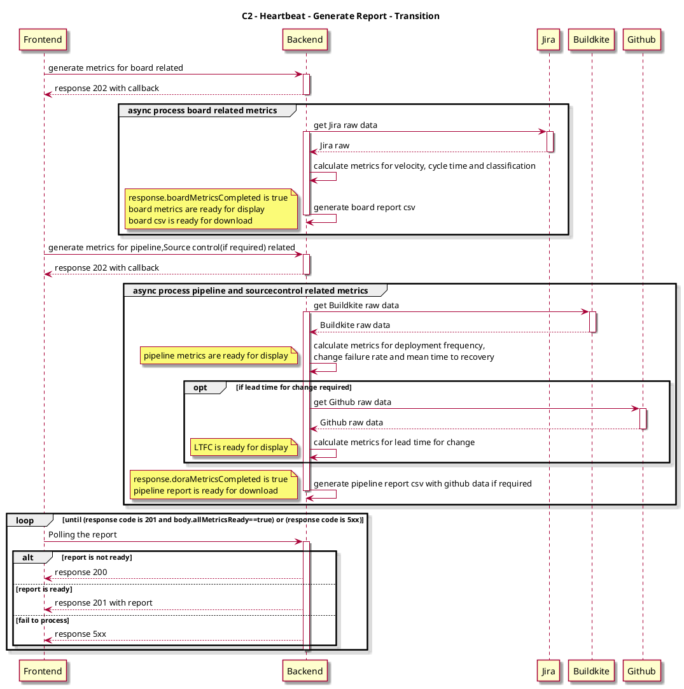

# Context
Considering there are some constrains that API call could not longer than 59 seconds from M Account, we have to re-fine our implementation by changing sync call to async. 

While it's not easy to make it at a once, we will do it step by step. Below are the design including C2 design with 
- AS-IS
- Transition
- TO-BE 


# Design
## C2 - Generate report - AS-IS

### Sequence Diagram

## C2 - Generate report - Transition
### Sequence Diagram

### API Design
+ Accepted generate report API
```
Method POST
URI: /api/v1/reports
Request payload:
{
  reoprtRequest...
}
Response:
202 Accepted
{
    "callbackUrl": "/api/v1/reports/{reportId}",
    "interval": 10
}
```
+ Callback generate report API
```
Method GET
URI: /api/v1/reports/{reportId}
Response:
204:
{
    "status": 204,   
}
201:
{
    "status": 201,
    reoprtData...   
}
```
Exception Table
<table>
  <tr>
    <td>status</td>
    <td>message</td>
    <td>hintInfo</td>
  </tr>
  <tr>
    <td rowspan="3">401</td>
    <td>Failed to get BuildKite info_status: 401...</td>
    <td rowspan="3">Token is incorrect</td>
  </tr>
  <tr>
    <td>Failed to get GitHub info_status: 401...</td>
  </tr>
  <tr>
    <td>Failed to get Jira info_status: 401...</td>
  </tr>
  <tr>
    <td rowspan="3">403</td>
    <td>Failed to get BuildKite info_status: 403...</td>
    <td rowspan="3">Permission deny</td>
  </tr>
  <tr>
    <td>Failed to get GitHub info_status: 403...</td>
  </tr>
  <tr>
    <td>Failed to get Jira info_status: 403...</td>
  </tr>
  <tr>
    <td rowspan="3">404</td>
    <td>Failed to get BuildKite info_status: 404...</td>
    <td rowspan="3">Not found</td>
  </tr>
  <tr>
    <td>Failed to get GitHub info_status: 404...</td>
  </tr>
  <tr>
    <td>Failed to get Jira info_status: 404...</td>
  </tr>
  <tr>
    <td rowspan="3">500</td>
    <td>Report time expires</td>
    <td rowspan="3">Failed to generate report</td>
  </tr>
  <tr>
    <td>Failed to write report file</td>
  </tr>
  <tr>
    <td>Failed to convert to report response</td>
  </tr>
  <tr>
    <td rowspan="3">503</td>
    <td>Failed to get BuildKite info_status: 503...</td>
    <td rowspan="3">Service unavailable</td>
  </tr>
  <tr>
    <td>Failed to get GitHub info_status: 503...</td>
  </tr>
  <tr>
    <td>Failed to get Jira info_status: 503...</td>
  </tr>
</table>
## C2 - Generate report - TO-BE
### Sequence Diagram



### API Design

+ Async generate board report 
```
POST /reports/{board}

Request payload:
{
    "considerHoliday": true,
    "startTime": "string",
    "endTime": "string",
    "metrics": [
      "string"
    ],
    "jiraBoardSetting": {
      "type": "string",
      "token": "string",
      "site": "string",
      "projectKey": "string",
      "boardId": "string",
      "doneColumn": [
        "string"
      ],
      "boardColumns": [
        {
          "name": "string",
          "value": "string"
        }
      ],
      "treatFlagCardAsBlock": true,
      "users": [
        "string"
      ],
      "assigneeFilter": "string",
      "targetFields": [
        {
          "key": "string",
          "name": "string",
          "flag": true
        }
      ]
    }
    "csvTimeStamp": "string"
}

Response:
202 Accepted
{
    "callbackUrl": "string",
    "interval": 0
}
```
+ Async generate dora report 
```
POST /reports/{dora}

Request payload:
{
    "considerHoliday": true,
    "startTime": "string",
    "endTime": "string",
    "metrics": [
      "string"
    ],
    "buildKiteSetting": {
      "type": "string",
      "token": "string",
      "deploymentEnvList": [
        {
          "orgId": "string",
          "orgName": "string",
          "id": "string",
          "name": "string",
          "step": "string",
          "repository": "string",
          "branches": [
            "string"
          ]
        }
      ],
      "pipelineCrews": [
        "string"
      ]
    },
    "codebaseSetting": {
      "type": "string",
      "token": "string",
      "leadTime": [
        {
          "orgId": "string",
          "orgName": "string",
          "id": "string",
          "name": "string",
          "step": "string",
          "repository": "string",
          "branches": [
            "string"
          ]
        }
      ]
    },
    "csvTimeStamp": "string"
}

Response:
202 Accepted
{
    "callbackUrl": "string",
    "interval": 0
}
```

+ Callback to retrieve reports
```
GET /reports/{reportId}
Response:
204 No Content

201 Created
{
    "velocity": {
      "velocityForSP": 0,
      "velocityForCards": 0
    } <could be null if not required>,
    "classificationList": [
      {
        "fieldName": "string",
        "pairList": [
          {
            "name": "string",
            "value": 0
          }
        ]
      }
    ] <could be null if not required>,
    "cycleTime": {
      "totalTimeForCards": 0,
      "averageCycleTimePerCard": 0,
      "averageCycleTimePerSP": 0,
      "swimlaneList": [
        {
          "optionalItemName": "string",
          "averageTimeForSP": 0,
          "averageTimeForCards": 0,
          "totalTime": 0
        }
      ]
    } <could be null if not required>,
    "deploymentFrequency": {
      "avgDeploymentFrequency": {
        "name": "string",
        "deploymentFrequency": 0
      },
      "deploymentFrequencyOfPipelines": [
        {
          "name": "string",
          "step": "string",
          "deploymentFrequency": 0,
          "dailyDeploymentCounts": [
            {
              "date": "string",
              "count": 0
            }
          ]
        }
      ]
    } <could be null if not required>,
    "changeFailureRate": {
      "avgChangeFailureRate": {
        "name": "string",
        "totalTimes": 0,
        "totalFailedTimes": 0,
        "failureRate": 0
      } <could be null if not required>,
      "changeFailureRateOfPipelines": [
        {
          "name": "string",
          "step": "string",
          "failedTimesOfPipeline": 0,
          "totalTimesOfPipeline": 0,
          "failureRate": 0
        }
      ]
    } <could be null if not required>,
    "meanTimeToRecovery": {
      "avgMeanTimeToRecovery": {
        "name": "string",
        "timeToRecovery": 0
      },
      "meanTimeRecoveryPipelines": [
        {
          "timeToRecovery": 0,
          "name": "string",
          "step": "string"
        }
      ]
    } <could be null if not required>,
    "leadTimeForChanges": {
      "leadTimeForChangesOfPipelines": [
        {
          "name": "string",
          "step": "string",
          "prLeadTime": 0,
          "pipelineLeadTime": 0,
          "totalDelayTime": 0
        }
      ],
      "avgLeadTimeForChanges": {
        "name": "string",
        "prLeadTime": 0,
        "pipelineLeadTime": 0,
        "totalDelayTime": 0
      }
    } <could be null if not required>,
    "reportMetricsError": {
      "boardMetricsError": {
        "status": 400,
        "errorMessage": "string"
      },
      "pipelineMetricsError": {
        "status": 400,
        "errorMessage": "string"
      },
      "sourceControlMetricsError": {
        "status": 400,
        "errorMessage": "string"
      },
    } <could be null if not required>,
    "boardMetricsCompleted": boolean <default is false>, 
    "doraMetricsCompleted": boolean <default is false>, 
    "allMetricsCompleted": boolean <default is false>,
    "exportValidityTime": 0
}
```
