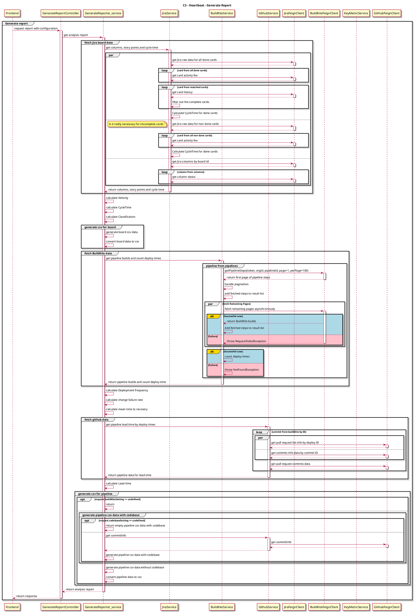
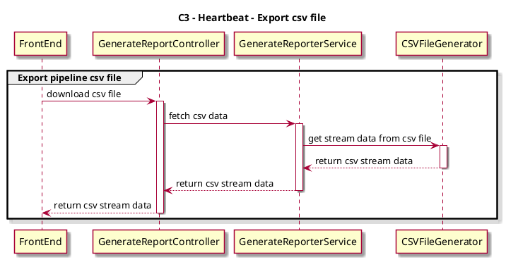

## C3 - Generate Report

```plantuml
@startuml report
skin rose
title C3 - Heartbeat - Generate Report
participant Frontend
participant GenerateReportController
participant GenerateReporter_service
participant JiraService
participant BuildKiteService
participant GithubService
participant JiraFeignClient
participant BuildKiteFeignClient
participant KeyMetricService
group Generate report
Frontend -> GenerateReportController: request report with configuration
activate GenerateReportController
GenerateReportController -> GenerateReporter_service: get analysis report
activate GenerateReporter_service
group fetch jira board data
GenerateReporter_service -> JiraService: get columns, story points and cycle time
activate JiraService
par
  JiraService -> JiraFeignClient: get Jira raw data for all done cards
  activate JiraFeignClient
  JiraFeignClient --> JiraService:
  deactivate JiraFeignClient
  loop card from all done cards
    JiraService -> JiraFeignClient: get card activity fee
    activate JiraFeignClient
    JiraFeignClient --> JiraService
    deactivate JiraFeignClient
  end
  loop card from matched cards
    JiraService -> JiraFeignClient: get card history
    activate JiraFeignClient
    JiraFeignClient --> JiraService
    deactivate JiraFeignClient
    JiraService -> JiraService: filter out the complete cards.
  end
  JiraService -> JiraService: Calculate CycleTime for done cards
else
  JiraService -> JiraFeignClient: get Jira raw data for non done cards
  note left
    Is it really necessary for imcomplete cards
  end note
  activate JiraFeignClient
  JiraFeignClient --> JiraService:
  deactivate JiraFeignClient
  loop card from all non done cards
    JiraService -> JiraFeignClient: get card activity fee
    activate JiraFeignClient
    JiraFeignClient --> JiraService
    deactivate JiraFeignClient
  end
  JiraService -> JiraService: Calculate CycleTime for done cards
else
  JiraService -> JiraFeignClient: get Jira columns by board Id
  activate JiraFeignClient
  JiraFeignClient --> JiraService:
  deactivate JiraFeignClient
  loop column from columns
    JiraService -> JiraFeignClient: get column status
    activate JiraFeignClient
    JiraFeignClient --> JiraService
    deactivate JiraFeignClient
  end
end

JiraService --> GenerateReporter_service: return columns, story points and cycle time


deactivate JiraService
end

GenerateReporter_service -> GenerateReporter_service: calculate Velocity
GenerateReporter_service -> GenerateReporter_service: calculate CycleTime
GenerateReporter_service -> GenerateReporter_service: calculate Classification
group generate csv for board
    GenerateReporter_service -> GenerateReporter_service: generate board csv data
    GenerateReporter_service -> GenerateReporter_service: convert board data to csv
end


group fetch BuildKite data
GenerateReporter_service -> BuildKiteService: get pipeline builds and count deploy times
activate BuildKiteService

group pipeline from pipelines
BuildKiteService -> BuildKiteFeignClient: getPipelineSteps(token, orgId, pipelineId, page=1, perPage=100)
activate BuildKiteFeignClient
BuildKiteFeignClient --> BuildKiteService: return first page of pipeline steps
deactivate BuildKiteFeignClient

BuildKiteService -> BuildKiteService: handle pagination
BuildKiteService -> BuildKiteService: add fetched steps to result list

  par fetch Remaining Pages
    BuildKiteService -> BuildKiteFeignClient: fetch remaining pages asynchronously
    activate BuildKiteFeignClient
      alt#Gold #LightBlue Successful case
        BuildKiteFeignClient --> BuildKiteService: return BuildKite builds
        BuildKiteService -> BuildKiteService: Add fetched steps to result list
      else #Pink Failure
        BuildKiteFeignClient --> BuildKiteService: throw RequestFailedException
      deactivate BuildKiteFeignClient
      end
    end
    alt#Gold #LightBlue Successful case
      BuildKiteService -> BuildKiteService:count deploy times
    else #Pink Failure
      BuildKiteService -> BuildKiteService: throw NotFoundException
    end
end

BuildKiteService --> GenerateReporter_service: return pipeline builds and count deploy time

deactivate BuildKiteService
end

GenerateReporter_service -> GenerateReporter_service: calculate Deployment frequency
GenerateReporter_service -> GenerateReporter_service: calculate change failure rate
GenerateReporter_service -> GenerateReporter_service: calculate mean time to recovery

group fetch github data

deactivate GithubService
GenerateReporter_service -> GithubService: get pipeline lead time by deploy times
activate GithubService

loop commit from buildKite by ID
  par
    GithubService -> GitHubFeignClient: get pull request list info by deploy ID
    activate GitHubFeignClient
    GitHubFeignClient --> GithubService:
    deactivate GitHubFeignClient
  else
    GithubService -> GitHubFeignClient: get commits info data by commit ID
    activate GitHubFeignClient
    GitHubFeignClient --> GithubService:
    deactivate GitHubFeignClient
  end
  GithubService -> GitHubFeignClient: get pull request commits data
  activate GitHubFeignClient
  GitHubFeignClient --> GithubService:
  deactivate GitHubFeignClient
  deactivate GitHubFeignClient
end

GithubService --> GenerateReporter_service: return pipeline data for lead time
deactivate GithubService
end

GenerateReporter_service -> GenerateReporter_service: calculate Lead time

group generate csv for pipeline

  opt request.buildKiteSetting == undefined
  GenerateReporter_service -> GenerateReporter_service: return
  else
    group generate pipeline csv data with codebase

      opt request.codebaseSetting == undefined
      GenerateReporter_service -> GenerateReporter_service: return empty pipeline csv data with codebase
      else
        GenerateReporter_service -> GithubService: get commitInfo
        activate GithubService
        GithubService -> GitHubFeignClient: get commitInfo
        activate GitHubFeignClient
        GitHubFeignClient --> GithubService
        deactivate GitHubFeignClient
        GithubService --> GenerateReporter_service
        deactivate GithubService
        GenerateReporter_service -> GenerateReporter_service: generate pipeline csv data with codebase
      end

    end
    GenerateReporter_service -> GenerateReporter_service: generate pipeline csv data without codebase
    GenerateReporter_service -> GenerateReporter_service: convert pipeline data to csv
  end

end

GenerateReporter_service --> GenerateReportController: return analysis report
deactivate GenerateReporter_service
GenerateReportController --> Frontend: return response
deactivate GenerateReportController
end
@enduml
```

## C3 - Export CSV

```plantuml
@startuml Export csv file
skin rose
title C3 - Heartbeat - Export csv file

participant FrontEnd
participant GenerateReportController
participant GenerateReporterService
participant CSVFileGenerator

group Export pipeline csv file
    FrontEnd -> GenerateReportController : download csv file
    activate GenerateReportController
    GenerateReportController -> GenerateReporterService: fetch csv data
    activate GenerateReporterService
    GenerateReporterService -> CSVFileGenerator: get stream data from csv file
    activate CSVFileGenerator
    GenerateReporterService <-- CSVFileGenerator: return csv stream data
    deactivate CSVFileGenerator
    GenerateReportController <-- GenerateReporterService: return csv stream data
    deactivate GenerateReporterService
    FrontEnd <-- GenerateReportController : return csv stream data
    deactivate GenerateReportController
end
@enduml

```
