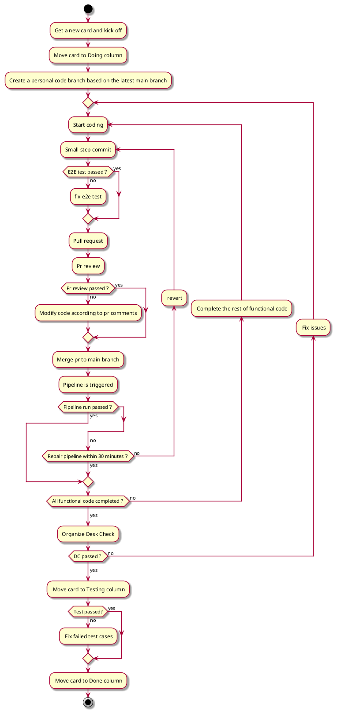

## Notes

- How to start E2E test please look at docs: start-e2e-test-in-local.
- When creating PR, the base repository is `au-heartbeat/Heartbeat`, and the base is `main`.
- When merging pr to main branch, please make sure add tags to trigger buildKite pipeline, you can refer to the `README.md` for details
