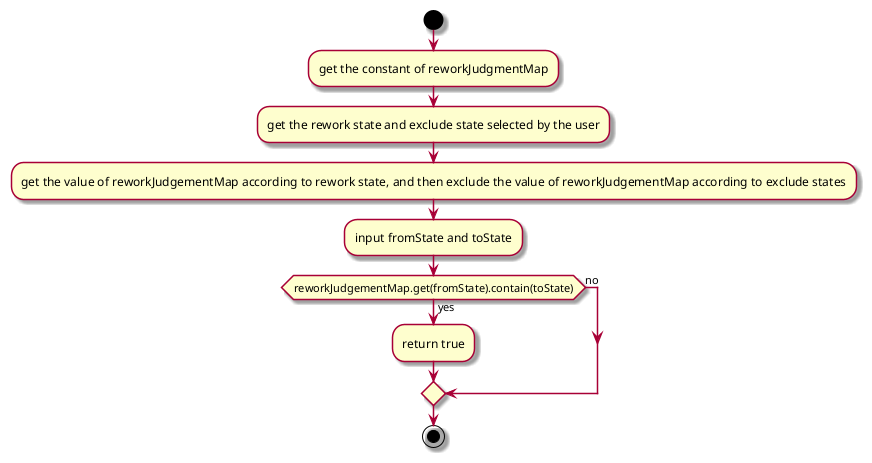
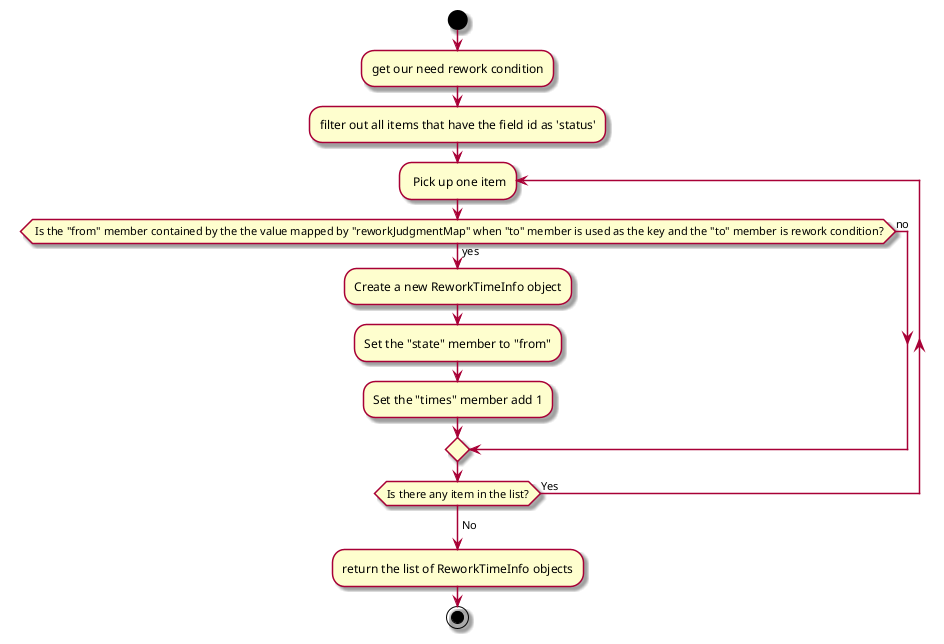
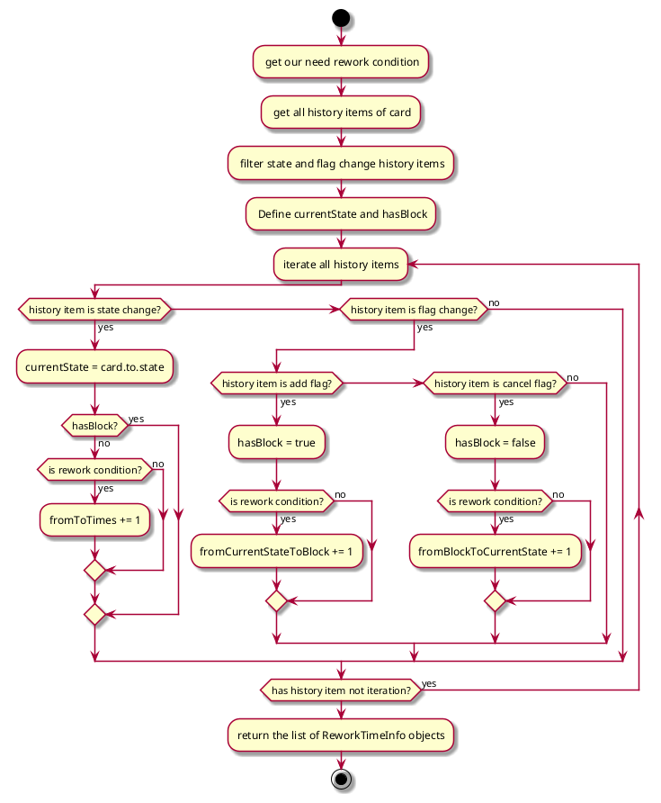

#

## Background

According to the needs of the business, users believe that analyzing the overall situation of the flow state of the card can be a good way to find the problems of the team and optimize the team.

## Expect

 1. View the rework times of all cards in the current iteration. 
 2. Export the rework times of each card.

## Solutions

### 1. Modifying the original API

#### 1.1 Modifying to generate report API design
On the design of the original report generating API, a new rework setting is added to the request body.
- TO-BE
```json
path: /reports/{metricType}
method: POST
request body: {
  ...
  "reworkTimesSetting" : {
      "reworkState": String
      "excludedStates": List<String>
  }
}
```

#### 1.2 Modifying to query generation metric API design
On the design of the original query generation metric API,  add rework metrics data to the response body.
- TO-BE
```json
path: /reports/{reportId}
method: GET
response: {
  ...
  "rework" : {
      "totalReworkTimes": Integer
      "reworkState": String
      "fromToDo": Integer
      "fromInDev": Integer
      "fromBlock": Integer
      "fromWaitingForTesting": Integer
      "fromTesting": Integer
      "fromReview": Integer
      "fromDone": Integer
      "totalReworkCards": Integer
      "reworkCardsRatio": Double

  }
}
```

### 2. Calculate rework times and return to frontend

We will calculate rework times for each `from state` on every real done card. The specific tasks are as follows:

1. In the `JiraService.getRealDoneCards()` method, we added a new line that references the getReworkTimes method below the line getAssigneeSet().
2. We created a new method called `getReworkTimes()`, which receives a `CardHistoryResponseDTO` and returns a list of `ReworkTimeInfo`, which is a class as follows:

```
ReworkTimeInfo
{
  "state": "In Dev",
  "times": 1
}
```

`ReworkTimeInfo` has two variables, `state` stores the rework target state. And `times` stores the rework times which is initialized to 0.

3. We define a `reworkJudgmentMap` map, whose key is target rework state and value is a set containing source states.

  ```
   reworkJudgmentMap.put(ANALYSE, Set.of(TODO, DEVELOPMENT, BLOCK, REVIEW, WAITING, TESTING, DONE));
   reworkJudgmentMap.put(TODO, Set.of(DEVELOPMENT, BLOCK, REVIEW, WAITING, TESTING, DONE));
   reworkJudgmentMap.put(DEVELOPMENT, Set.of(BLOCK, REVIEW, WAITING, TESTING, DONE));
   reworkJudgmentMap.put(BLOCK, Set.of(REVIEW, WAITING, TESTING, DONE));
   reworkJudgmentMap.put(REVIEW, Set.of(WAITING, TESTING, DONE));
   reworkJudgmentMap.put(WAITING, Set.of(TESTING, DONE));
   reworkJudgmentMap.put(TESTING, Set.of(DONE));
  ```

4. Determine the rework we need, there are three condition
- Initialize rework judgment.
- Rework state selected by the user.
- User excluded state.


5. In the `getReworkTimes()` method, if user not check "Consider the 'Flag' as 'Block', we will do as follows:


6. Some users are in the block state according to the added flag, so if user check "Consider the 'Flag' as 'Block', and the calculation logic should change, the implementation pseudocode is as follows:


7. We set the `ReworkTimeInfo` list in `JiraCardDTO` object as `reworkTimeInfos` member variables.
8. In the `GenerateReporterService.generateBoardReporter()` method, we use `reworkTimeInfos` variable in `JiraCardDTO` object calculate rework metrics and put them to `ReportResponse`, which are the same as the API in the 1.2 section.
    - We traverse all items in `reworkTimeInfos` and sum the rework times in each state.
    - Then we sum the total time of reworks in each state as the `totalReworkTimes`.
    - If a card's `reworkTimeInfos` is not empty, we set `totalReworkCards` add one.
    - The `reworkCardsRatio` is calculated by dividing `totalReworkCards` by total real done card count on the current sprint.


### 3. Modifying the logic of generating a board csv
When generating the board csv file, we need to export the rework information of each card, so we need to add a series of table header information, and assemble and filter according to the config provided by reworkSetting. The following is the full table header information about rework:

- rework times to `state`
- from in todo to `state`
- from in dev to `state`
- from block to `state`
- from review to `state`
- from waiting for testing to `state`
- from testing to `state`
- from done to `state`

`state` is the rework in our previous setting, and the exported table header is spliced according to it.

According to business needs, we will only have some headers, for example, we need to calculate `rework to review`, exported headers will have `rework times to review` , `from done to waiting for testing`,`from done to testing` and `from done to review`. Because the meaning of rework is to calculate from the subsequent process to the previous process

*Implementation method*

In 2, we have obtained `reworkTimeInfos`, and then can use this data to write into a csv file.

tasking:
- In `KanbanCsvService.generateCSVForBoard()` method, we need to use reworkTimeInfos to build table header. Reference CycleTimeInfo to build the header.
- In `CSVFileGenerator.getFixedFieldsData()` method, we need to build the row for rework. Reference `CSVFileGenerator.getOriginCycleTimePerRow()`.
