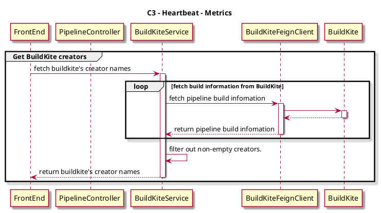
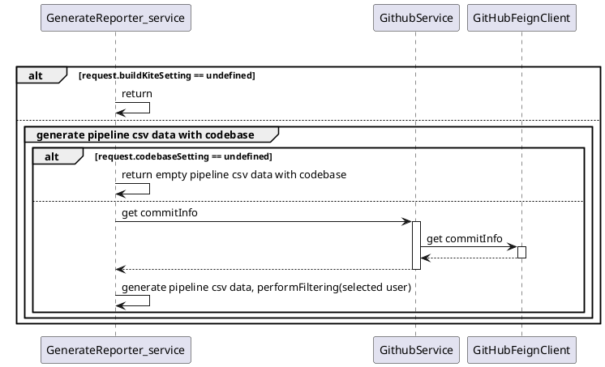

# Spike -- Add buildKite user field for pipeline setting in metrics page

## Current situation

Existing pipeline calculation doesn’t consider crew members which might introduce issues like some pipelines were not triggered by your team. As a result, the Lead time for change, change failure rate, deployment frequency, and MTTR might not be precise.

## Expect

If user could select related crew member(Buildkite User) for their pipeline trigger, it will **filter out unrelated pipelines**.

## Solutions

### 1. Get all committers by buildkite API

#### 1.1 BuildKite API

```shell
curl "https://api.buildkite.com/v2/organizations/{org.slug}/pipelines/{pipeline.slug}/builds"
```

#### 1.2 Response body

```json
[
  {
    "id": "f62a1b4d-10f9-4790-bc1c-e2c3a0c80983",
    "graphql_id": "QnVpbGQtLS1mYmQ2Zjk3OS0yOTRhLTQ3ZjItOTU0Ni1lNTk0M2VlMTAwNzE=",
    "url": "https://api.buildkite.com/v2/organizations/my-great-org/pipelines/my-pipeline/builds/1",
    "web_url": "https://buildkite.com/my-great-org/my-pipeline/builds/1",
    "number": 1,
    "state": "passed",
    "blocked": false,
    "message": "Bumping to version 0.2-beta.6",
    "commit": "abcd0b72a1e580e90712cdd9eb26d3fb41cd09c8",
    "branch": "main",
    "env": {},
    "source": "webhook",
    "creator": {
      "id": "3d3c3bf0-7d58-4afe-8fe7-b3017d5504de",
      "name": "Keith Pitt", //this is our need
      "email": "keith@buildkite.com",
      "avatar_url": "https://www.gravatar.com/avatar/e14f55d3f939977cecbf51b64ff6f861",
      "created_at": "2015-05-22T12:36:45.309Z"
    }
  }
]
```

#### 1.3 Description

We need the creator field. for example, in this piece buildKite build information, the creator is guzhongren.


We need to add a new api to get all creators within the selected time range, and return the buildKite creators to fronted render selected box like this


#### 1.4 Sequence Diagram (C3 - Heartbeat - Metrics)



#### 1.5 Example

Using the BuildKite API, we can get all pipeline build records, including failed records, which may be auto-triggered by Dependabot. We should filter out these records and get non-empty creators


### 2. Filter selected username and generate CSV file

#### 2.1 Sequence Diagram (C3 - Generate CSV for pipeline)



1. existed code:
   When generate pipeline csv data default for every committers within the selected time range
2. expected:
   Generate report data only for the selected person. The selected person is a parameter passed from the front end.
3. Code implementation:
   Extend the parameter of CodebaseSetting with selected committers in the method of generateCSVForPipelineWithCodebase, use stream api to filter commit information and get selected committers' infomation to generate pipeline csv data

#### 2.2 example

We tried to complete it at local, and the result of the generated CSV file as follows:

In this case, we just only want the information of the two specify Committers(also known as GitHub user) - [guzhongren, wangwang.zhang], The generated CSV shows that we successfully obtained only the information of these two Committers.


​

###
