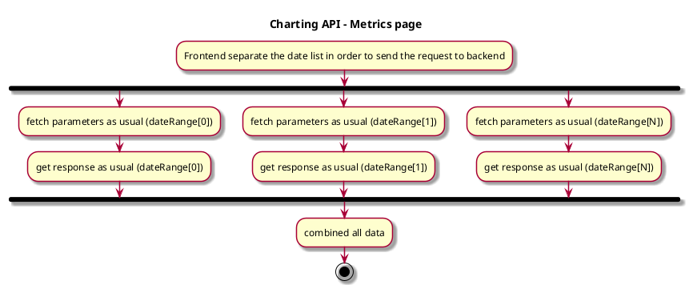
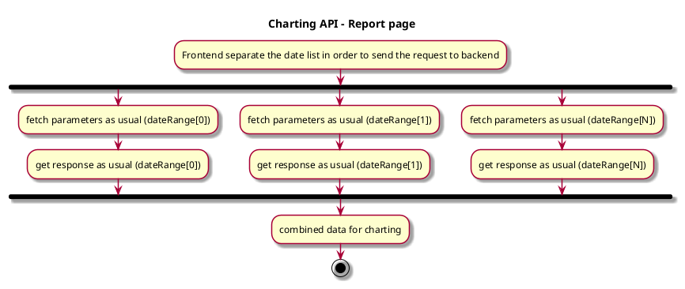

### Summary

As our roadmap planed, Heartbeat application will show charts with the all metrics data.
So that, the user can compare the historical data with different sprint.

We need to choose a charting backend and frontend API refactor solution to implement the design.

### Context

According to the new business requirements and the roadmap, there are some points for charting API refactor.

* Support metrics page frontend transfer more date list and call backend API
* Support report page frontend transfer more date list and call backend API

### Options

#### Metrics page 

FrontEnd can get the date list and separate it in order to send the request.

```json
dateRange: [
  {
    "startDate": "2024-02-01T00:00:00.000+08:00",
    "endDate": "2024-02-14T23:59:59.999+08:00"
  },
  {
      "startDate": "2024-02-15T00:00:00.000+08:00",
      "endDate": "2024-02-29T23:59:59.999+08:00"
    },
],
```



As shown in the image, we want to refactor the frontend and backend solutions for metrics page. About `board info`, `pipelines info`,
`pipelines step` API, we can transfer multiple stage date list params by multiple times call for backend.
When the frontend calls the backend API in parallel multiple times, backend invoke original service to handle logic and return response.
Then we accept all responses from the backend and combine the data for parallel processing of data.

The APIs for the metrics page that we do not need to modify are as follows: 
- POST /boards/`{boardType}`/info
- POST /pipelines/`{pipelineType}`/info
- POST /pipelines/`{pipelineType}`/`{organizationId}`/pipelines/`{buildId}`/steps

#### Report page



As shown in the image, we want to refactor the frontend and backend solutions for report page. About `reports board`, `reports dora`,
`reports poll {reportId}` API, we can transfer date info time and time again. Due to the logic of the report page.
Then we accept all responses from the backend and combine the data for charting.
 
The APIs for the report page that we do not need to modify are as follows:
- POST /reports
- GET /reports/`{reportId}`
- GET /reports/metric/`{reportId}`
- GET /reports/board/`{reportId}`
- GET /reports/pipeline/`{reportId}`


Corresponding information about chart information and response:

- velocity: 
```json
"velocity": {
  "velocityForSP": 30.0,
  "velocityForCards": 22
}
```

- Average Cycle Time:
```json
"cycleTime": {
  "averageCycleTimePerCard": 4.03,
  "averageCycleTimePerSP": 2.96
}
```

- Cycle Time Allocation 
```json
// Total cycle time
"cycleTime": {
  "totalTimeForCards": 88.67
}

// Total development time
{
  "optionalItemName": "In Dev",
  "averageTimeForSP": 1.66,
  "averageTimeForCards": 2.26,
  "totalTime": 49.67
},

// Block time
{
  "optionalItemName": "Block",
  "averageTimeForSP": 0.28,
  "averageTimeForCards": 0.38,
  "totalTime": 8.3
},

// Review time
{
  "optionalItemName": "Review",
  "averageTimeForSP": 0.26,
  "averageTimeForCards": 0.35,
  "totalTime": 7.69
},

// Wait for testing time
{
  "optionalItemName": "Waiting for testing",
  "averageTimeForSP": 0.4,
  "averageTimeForCards": 0.54,
  "totalTime": 11.96
},

// Testing time
{
  "optionalItemName": "Testing",
  "averageTimeForSP": 0.37,
  "averageTimeForCards": 0.5,
  "totalTime": 11.05
}

```

- Rework
```json
"rework": {
  // Total rework times
  "totalReworkTimes": 2,
  // Total rework cards
  "totalReworkCards": 2,
  // Total cards ratio
  "reworkCardsRatio": 0.6667
},
```
