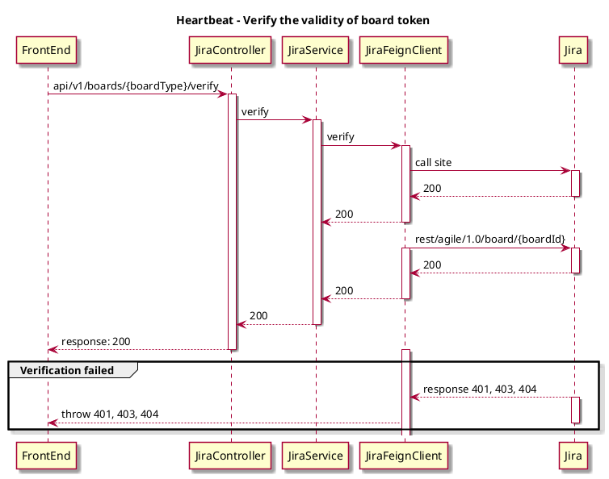
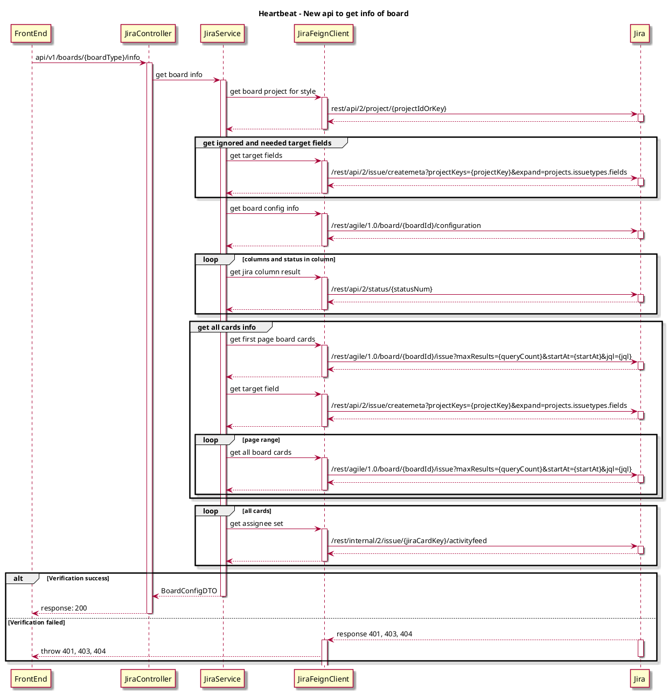

#

## Background

Verify the board setting on config page, there is some data redundancy. Besides, users will reset the verify status when modifying the date, resulting in a bad user experience.

## Expect

 1. More simplified Verify API. 
 2. New api to get info of datasource.

## Solutions

### 1. Split the origin board verify API

#### 1.1 API Design

- AS-IS
```json
paths: api/v1/boards/{boardType}
method: POST
request: {
  "type": "...",
  "boardId": "...",
  "projectKey": "...",
  "site": "...",
  "token(email+token)": "...",
  "startTime": "...",
  "endTime": "..."
}
responses:
  '200': {
    "users": [
        "..."
    ],
    "targetFields": [
        {
            "key": "...",
            "name": "...",
            "flag": false
        }
    ],
    "ignoredTargetFields": [
        {
            "key": "...",
            "name": "...",
            "flag": false
        }
    ],
    "jiraColumns": [
        {
            "key": "...",
            "value": {
                "name": "...",
                "statuses": [
                    "..."
                ]
            }
        }
    ]
}
```

- TO-BE
```json
paths: api/v1/boards/{boardType}/verify
method: POST
request: {
  "boardId": "...",
  "site": "...",
  "token(email+token)": "..."
}
responses: {
  "project": "ADM"
}
```

- Exception Handler

| status | message                                           | hintInfo               |
|--------|---------------------------------------------------|------------------------|
| 400    | Token cannot be empty.                            | Please reconfirm the input |
| 400    | Token's pattern is incorrect.                     | Please reconfirm the input |
| 400    | boardType param is not correct                    | Please reconfirm the input |
| 401    | Failed to get Jira info_status: 401 UNAUTHORIZED, reason: xxx | Token is incorrect |
| 403    | Failed to get Jira info_status: 403 FORBIDDEN, reason: xxx   | 403 Forbidden       |
| 404    | Failed to get Jira info_status: 404 NOT_FOUND, reason: xxx   | 404 site Not Found       |
| 404    | Failed to get Jira info_status: 404 NOT_FOUND, reason: xxx   | 404 boardId Not Found       |
| 500    |                                                   | Internal Server Error  |

- Jira API

[Get board](https://docs.atlassian.com/jira-software/REST/7.0.4/#agile/1.0/board)

```
paths: https://%s.atlassian.net/rest/agile/1.0/board/{boardId}
method: GET
header: "Authorization: Bearer <YOUR-TOKEN>"
```

#### 1.2 Sequence Diagram



### 2. New api to get info of board

Returns datas from a board, for a given board Id. Board configuration will use those datas, like Crew settings, Cycle time settings, Classification setting.
The new api to get info of board will load when metrics page load board contents.

#### 2.1 Request

##### URL
```json
POST api/v1/boards/{boardType}/info
```

##### Request body


| Body                      | Type                                                                                                          | Description                                                                       | Note |
| :------------------------ | :------------------------------------------------------------------------------------------------------------ | :-------------------------------------------------------------------------------- | :--- |
| boardId                   | string                                                                                                        | Board ID.                                                                         |      |
| projectKey                | string                                                                                                        | Specify the key of the project.                                                   |      |
| site                      | string                                                                                                        | Host url of the board.                                                            |      |
| token                     | string                                                                                                        | Authentication for board, it is included email and token input                    |      |
| startTime                 | string                                                                                                        | Fillter results by startTime, it will use in [JQL](https://docs.atlassian.com/jira-software/REST/7.0.4/#agile/1.0/board-getConfiguration:~:text=Get%20issues%20for%20board) to get data.                                |      |
| endTime                   | string                                                                                                        | Fillter results by endTime, it will use in [JQL](https://docs.atlassian.com/jira-software/REST/7.0.4/#agile/1.0/board-getConfiguration:~:text=Get%20issues%20for%20board) to get data.                                 |      |

Example
```json
{
  "boardId": "2",
  "projectKey": "ADM",
  "site": "dorametrics",
  "token": "token",
  "startTime": 1700409600000,
  "endTime": 1701619199999
}
```

#### 2.2 Response
```json
{
    "users": [
        "heartbeat user0",
        "heartbeat user1"
    ],
    "targetFields": [
        {
            "key": "issuetype",
            "name": "Issue Type",
            "flag": false
        }
    ],
    "ignoredTargetFields": [
        {
            "key": "summary",
            "name": "Summary",
            "flag": false
        }
    ],
    "jiraColumns": [
        {
            "key": "To Do",
            "value": {
                "name": "TODO",
                "statuses": [
                    "TODO"
                ]
            }
        },
        {
            "key": "In Progress",
            "value": {
                "name": "Doing",
                "statuses": [
                    "DOING"
                ]
            }
        }
    ]
}
```

- Exception Handler

| status | message                                           | hintInfo               |
|--------|---------------------------------------------------|------------------------|
| 400    | The startTime should be before the endTime.                                | Please reconfirm the input |
| 400    | Token cannot be empty.                            | Please reconfirm the input |
| 400    | Token's pattern is incorrect.                     | Please reconfirm the input |
| 400    | boardType param is not correct                    | Please reconfirm the input |
| 401    | Failed to get Jira info_status: 401 UNAUTHORIZED, reason: xxx | Token is incorrect |
| 403    | There is no enough permission.                    | Permission deny        |
| 404    | Failed to get Jira info_status: 404 NOT_FOUND, reason: xxx   | 404 Not Found       |
| 500    |                                                   | Internal Server Error  |

#### 2.3 Sequence Diagram


