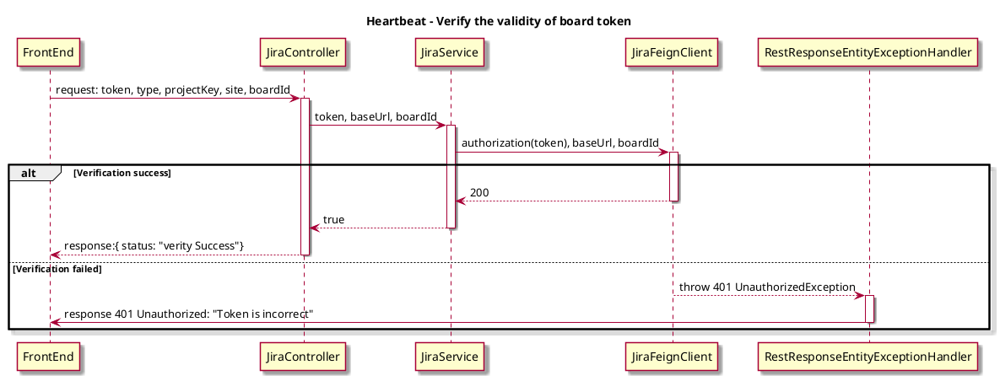
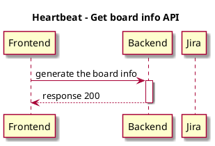

# Spike -- Split verify of board on config page

## Background

Verify the board setting on config page, there is some data redundancy. Besides, users will reset the verify status when modifying the date, resulting in a bad user experience.

## Expect

 1. More simplified Verify API. 
 2. New api to get info of datasource.

## Solutions

### 1. Split the origin board verify API

#### 1.1 API Design

- before
```json
paths: api/v1/boards
method: post
request: {
  "type": "...",
  "boardId": "...",
  "projectKey": "...",
  "site": "...",
  "token": "...",
  "startTime": "...",
  "endTime": "..."
}
responses:
  '200': {
    "users": [
        "..."
    ],
    "targetFields": [
        {
            "key": "...",
            "name": "...",
            "flag": false
        }
    ],
    "ignoredTargetFields": [
        {
            "key": "...",
            "name": "...",
            "flag": false
        }
    ],
    "jiraColumns": [
        {
            "key": "...",
            "value": {
                "name": "...",
                "statuses": [
                    "..."
                ]
            }
        }
    ]
}
```

- after
```json
paths: api/v1/boards
method: post
request: {
  "type": "...",
  "boardId": "...",
  "projectKey": "...",
  "site": "...",
  "token": "..."
}
responses:
  '200': {
    status: "verity Success"
}
```

- Jira API

```
paths: https://%s.atlassian.net/rest/agile/1.0/board/{boardId}/configuration
method: get
header: "Authorization: Bearer <YOUR-TOKEN>"
```

#### 1.2 Description
We split the origin board verify API in the config page.If the status code of the result returned by the api is 200, the verify is passed.

#### 1.3 Sequence Diagram (board verify API)



### 2. Add 'get board info' API

#### 2.1 Response body

```json
{
    "users": [
        "XXX",
        "XXXX"
    ],
    "targetFields": [
        {
            "key": "XX",
            "name": "XXX",
            "flag": false
        }
    ],
    "ignoredTargetFields": [
        {
            "key": "XX",
            "name": "XXX",
            "flag": false
        }
    ],
    "jiraColumns": [
        {
            "key": "XX",
            "value": {
                "name": "XXX",
                "statuses": [
                    "XXX"
                ]
            }
        }
    ]
}
```

#### 2.2 Description
We add `get board info` API contents.Keep data from previous board API.
The timing of the API call occurs when loading the corresponding data on the Metrics page.
If the data is not yet fully loaded, the front end will display a loading state.

#### 2.3 Sequence Diagram (get board info API)


