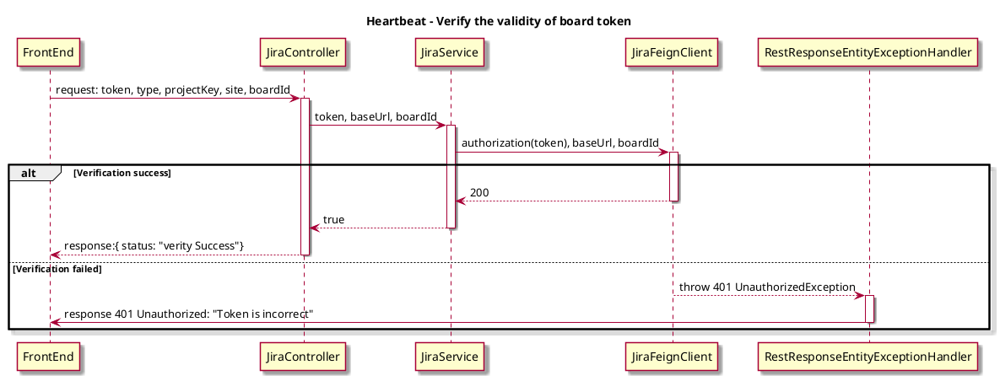

# Spike -- Split verify of board on config page

## Background

Verify the board setting on config page, there is some data redundancy. Besides, users will reset the verify status when modifying the date, resulting in a bad user experience.

## Expect

 1. More simplified Verify API. 
 2. New api to get info of datasource.

## Solutions

### 1. Split the origin board verify API

#### 1.1 API Design

- before
```json
paths: api/v1/boards/{boardType}
method: POST
request: {
  "type": "...",
  "boardId": "...",
  "projectKey": "...",
  "site": "...",
  "token": "...",
  "startTime": "...",
  "endTime": "..."
}
responses:
  '200': {
    "users": [
        "..."
    ],
    "targetFields": [
        {
            "key": "...",
            "name": "...",
            "flag": false
        }
    ],
    "ignoredTargetFields": [
        {
            "key": "...",
            "name": "...",
            "flag": false
        }
    ],
    "jiraColumns": [
        {
            "key": "...",
            "value": {
                "name": "...",
                "statuses": [
                    "..."
                ]
            }
        }
    ]
}
```

- after
```json
paths: api/v1/boards/{boardType}/verify
method: GET
parameters: {
  "type": "...",
  "boardId": "...",
  "projectKey": "...",
  "site": "...",
  "token": "..."
}
responses:
  '200': {
    status: "verity Success"
}
401 Unauthorized: "Token is incorrect"
```

- Jira API

[Jira docs](https://docs.atlassian.com/jira-software/REST/7.0.4/#agile/1.0/board-getConfiguration)

```
paths: https://%s.atlassian.net/rest/agile/1.0/board/{boardId}/configuration
method: GET
header: "Authorization: Bearer <YOUR-TOKEN>"
```

#### 1.2 Sequence Diagram



### 2. New api to get info of board

Returns datas from a board, for a given board Id. Board configuration will use those datas, like Crew settings, Cycle time settings, Classification setting.

#### 2.1 Request

##### URL
POST api/v1/boards

##### Request body


| Body                      | Type                                                                                                          | Description                                                                       | Note |
| :------------------------ | :------------------------------------------------------------------------------------------------------------ | :-------------------------------------------------------------------------------- | :--- |
| type                      | string                                                                                                        | Board type.                                                                       |      |
| boardId                   | string                                                                                                        | Board ID.                                                                         |      |
| projectKey                | string                                                                                                        | Specify the key of the project.                                                   |      |
| site                      | string                                                                                                        | Host url of the board.                                                            |      |
| token                     | string                                                                                                        | Authentication for board.                                                         |      |
| startTime                 | string                                                                                                        | Fillter results by startTime, it will use in [JQL](https://docs.atlassian.com/jira-software/REST/7.0.4/#agile/1.0/board-getConfiguration:~:text=Get%20issues%20for%20board) to get data.                                |      |
| endTime                   | string                                                                                                        | Fillter results by endTime, it will use in [JQL](https://docs.atlassian.com/jira-software/REST/7.0.4/#agile/1.0/board-getConfiguration:~:text=Get%20issues%20for%20board) to get data.                                 |      |

Example
```json
{
  "type": "Jira",
  "boardId": "2",
  "projectKey": "ADM",
  "site": "dorametrics",
  "token": "token",
  "startTime": 1700409600000,
  "endTime": 1701619199999
}
```

#### 2.2 Response
```json
{
    "users": [
        "heartbeat user0",
        "heartbeat user1"
    ],
    "targetFields": [
        {
            "key": "issuetype",
            "name": "Issue Type",
            "flag": false
        }
    ],
    "ignoredTargetFields": [
        {
            "key": "summary",
            "name": "Summary",
            "flag": false
        }
    ],
    "jiraColumns": [
        {
            "key": "To Do",
            "value": {
                "name": "TODO",
                "statuses": [
                    "TODO"
                ]
            }
        },
        {
            "key": "In Progress",
            "value": {
                "name": "Doing",
                "statuses": [
                    "DOING"
                ]
            }
        }
    ]
}
```
