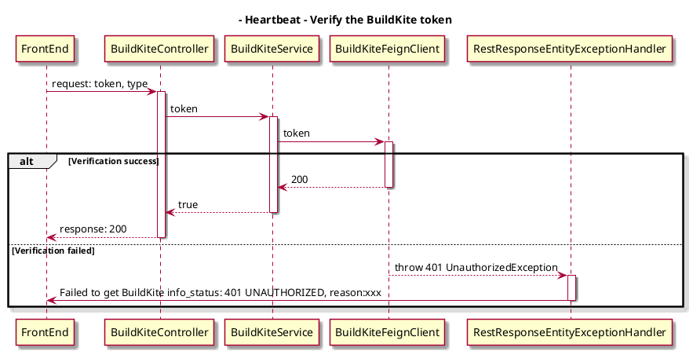
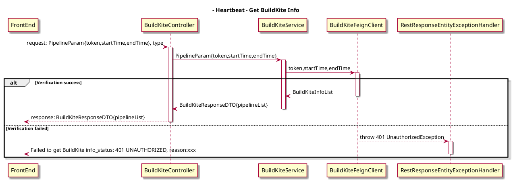

## Background
The BuildKite setting in config page, the original api obtains verify and get info two parts, now it should be split.

## Solutions
### 1. Verify the BuildKite token
- Api Design
```
paths: api/v1/BuildKite/verify
method: post
request: {
  token: "your_token",
  type: "BuildKite"
}
responses:
  Status Code: 200
```
- Exception Handler

  - 401: Failed to get BuildKite info_status: 401 UNAUTHORIZED, reason: xxx

- Sequence Diagram


### 2. getBuildKiteInfo 

- Api Design
```
paths: api/v1/BuildKite/info
method: post
request: {
  PipelineParam:{
  token:"your_token",
  startTime: "xxx",
  endTime:"xxx",
  } 
  type: "BuildKite"
}
responses:{
  "pipelineList": 
  [{
    "id": "xxx",
    "name": "xxx",
    "orgId": "xxx",
    "orgName": "xxx",
    "repository": "xxx",
    "steps": [
     "xxx",
      ]
    }]
}
```
- Exception Handler

  - 401: Failed to get BuildKite info_status: 401 UNAUTHORIZED, reason: xxx
  
- Sequence Diagram


### Solution detail

1.The first new api needs to be called when the Verify button is clicked. If true is returned, the token verification is successful.Otherwise an exception will be thrown.The logic of exception handling remains the same as before.

2.The second api should be called when entering the Metrics page. Don’t forget that the previous getPipelineSteps api still needs to be called. Only after these two parts of data(The second api and previous getPipelineSteps api) are obtained can the loading disappear.


