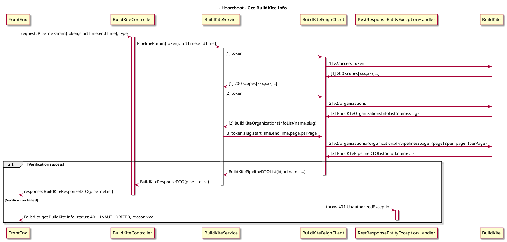
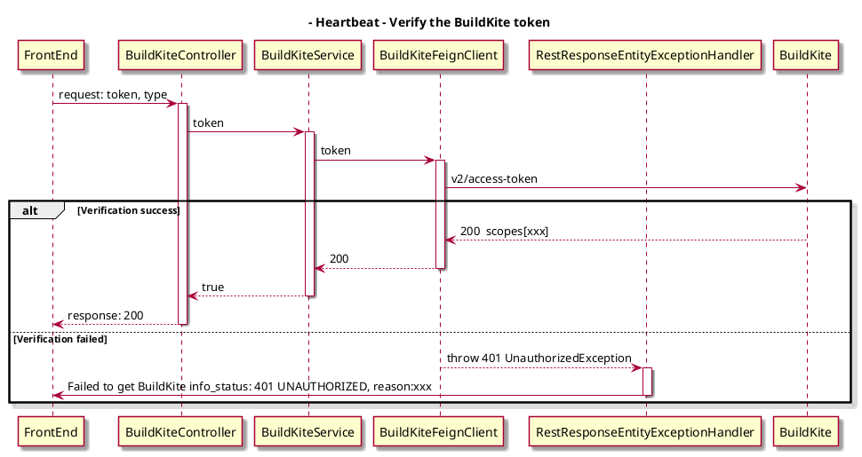
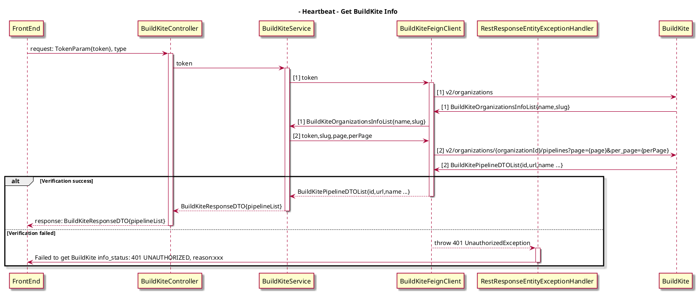

## Background
The BuildKite setting in config page, the original api obtains verify and get info two parts, now it should be split.

## AS-IS Design
- Api Design
```
paths: api/v1/pipelines/{pipelineType}
method: post
request: {
  PipelineParam:{
  token:"your_token",
  startTime: "xxx",
  endTime:"xxx",
  }
}
responses:{
  "pipelineList":
  [{
    "id": "xxx",
    "name": "xxx",
    "orgId": "xxx",
    "orgName": "xxx",
    "repository": "xxx",
    "steps": [
     "xxx",
      ]
    }]
}
```
- Sequence Diagram


## Solutions
### 1. Verify the BuildKite token
The new api need to be called when the Verify button is clicked. If return 200, the verification is successful.Otherwise 401 exception will be thrown.

- Api Design
```
paths: api/v1/pipelines/{pipelineType}/verify
method: post
request: {
  token: "your_token"
}
responses:
  Status Code: 204
```
- Exception Handler
<table>
  <tr>
    <td>status</td>
    <td>message</td>
    <td>hintInfo</td>
  </tr>
  <tr>
    <td>400</td>
    <td>Token cannot be empty.</td>
  </tr>
  <tr>
    <td>401</td>
    <td>Failed to get BuildKite info_status: 401 UNAUTHORIZED, reason: xxx</td>
    <td>Token is incorrect</td>
  </tr>
  <tr>
    <td>403</td>
    <td>Failed to call BuildKite, because of insufficient permission!</td>
    <td>Permission deny</td>
  </tr>
  <tr>
    <td>500</td>
      <td></td>
      <td>Internal Server Error</td>
  </tr>
</table>

- Sequence Diagram


### 2. getBuildKiteInfo
The api should be called when entering the Metrics page. Only after two parts of data(The api and previous getPipelineSteps api) are obtained can the loading disappear.
- Api Design
```
paths: api/v1/pipelines/{pipelineType}/info
method: post
request: {
  token:"your_token",
}
responses:{
  "pipelineList":
  [{
    "id": "xxx",
    "name": "xxx",
    "orgId": "xxx",
    "orgName": "xxx",
    "repository": "xxx",
    "steps": [
     "xxx",
      ]
    }]
}
When pipelineList is empty， responses 204
```
- Exception Handler
<table>
  <tr>
    <td>status</td>
    <td>message</td>
    <td>hintInfo</td>
  </tr>
  <tr>
    <td>400</td>
    <td>Token cannot be empty.</td>
    <td></td>
  </tr>
  <tr>
    <td>401</td>
    <td>Failed to get BuildKite info_status: 401 UNAUTHORIZED, reason: xxx</td>
    <td>Token is incorrect</td>
  </tr>
  <tr>
    <td>403</td>
    <td>Failed to call BuildKite, because of insufficient permission!</td>
    <td>Permission deny</td>
  </tr>
  <tr>
    <td>500</td>
      <td></td>
      <td>Internal Server Error</td>
  </tr>
</table>

- Sequence Diagram



