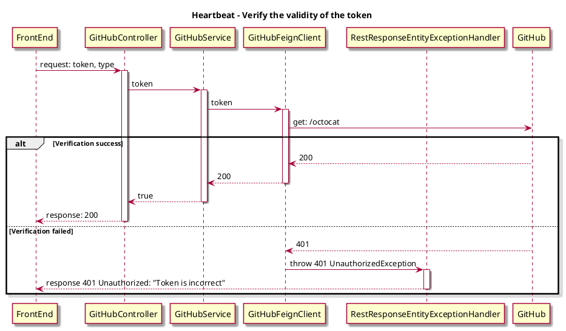
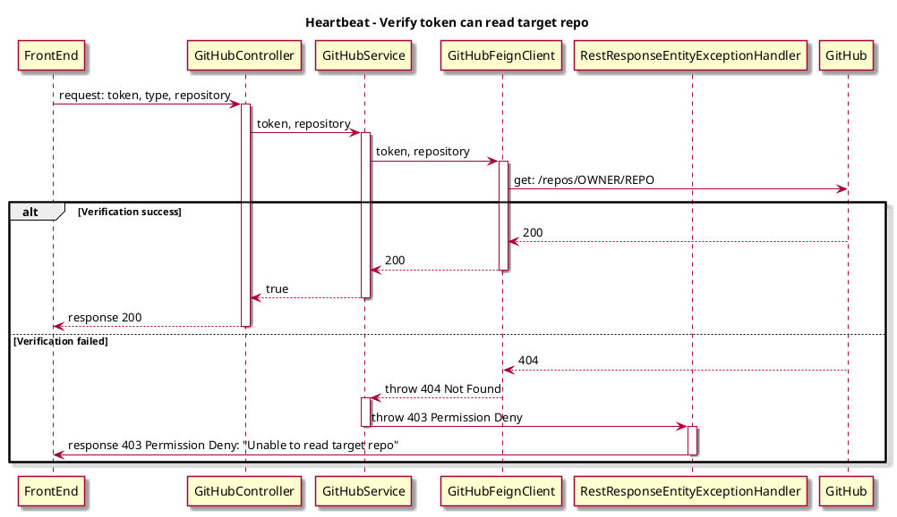

## Background

Verify the GitHub setting on config page, there is some data redundancy. Besides, users will reset the verify status when modifying the date, resulting in a bad user experience.

## Expect

Reduce the granularity of the step of verification and enables a new API for target resource verification.

## Solutions

Through two-stage verification of GitHub tokens, the first stage verifies the validity of the token, and the second stage verifies that the token can read the target repo

### 1. Verify the validity of the token

- Request timing

Triggered after clicking GitHub's verify on the config page

- Api Design
```
paths: /api/v1/source-control/{sourcetype}/verify
method: post
request: {
  token: "..."
}
responses:
  Status Code: 200
```
- GitHub Api for verification
```
paths: "https://api.github.com/octocat"
method: get
header: "Authorization: Bearer YOUR-TOKEN"
```
- Exception Handler
<table>
  <tr>
    <td>status</td>
    <td>message</td>
    <td>hintInfo</td>
  </tr>
  <tr>
    <td rowspan="4">400</td>
    <td>Token cannot be empty.</td>
    <td rowspan="4"></td>
  </tr>
  <tr>
    <td>Token's pattern is incorrect.</td>
  </tr>
  <tr>
    <td>Source type cannot be empty.</td>
  </tr>
  <tr>
    <td>Source type is incorrect.</td>
  </tr>
  <tr>
    <td>401</td>
    <td>Failed to get GitHub info_status: 401, reason: Bad credentials</td>
    <td>Token is incorrect</td>
  </tr>
</table>

- C3


### 2. Verify token can read target repo
- Request timing

Triggered when the Metrics page Pipeline setting module obtains Step

- Api Design
```
paths: /api/v1/source-control/{sourceType}/repos/verify
method: post
request: {
  repository: "git@github.com:XXXX/XXXX.git",
  token: "..."
}
responses:
  Status Code: 200
```
- GitHub Api for verification
```
paths: https://api.github.com/repos/OWNER/REPO
method: get
header: "Authorization: Bearer <YOUR-TOKEN>"
```
- Exception Handler
<table>
  <tr>
    <td>status</td>
    <td>message</td>
    <td>hintInfo</td>
  </tr>
  <tr>
    <td rowspan="6">400</td>
    <td>Token cannot be empty.</td>
    <td rowspan="6"></td>
  </tr>
  <tr>
    <td>Token's pattern is incorrect.</td>
  </tr>
  <tr>
    <td>Repository cannot be empty.</td>
  </tr>
  <tr>
    <td>Repository's pattern is incorrect.</td>
  </tr>
  <tr>
    <td>Source type cannot be empty.</td>
  </tr>
  <tr>
    <td>Source type is incorrect.</td>
  </tr>
  <tr>
    <td>401</td>
    <td>Failed to get GitHub info_status: 401, reason: Bad credentials</td>
    <td>Token is incorrect</td>
  </tr>
  <tr>
    <td>403</td>
    <td>Unable to read target repo</td>
    <td>Unable to read target repo, please recheck the token!</td>
  </tr>
</table>

- C3

