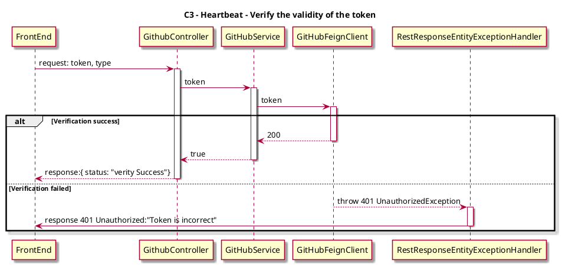

# Spike -- Split verify of GitHub on config page

## Background

Verify the GitHub setting on config page, there is some data redundancy. Besides, users will reset the verify status when modifying the date, resulting in a bad user experience.

## Expect

 1. More simplified Verify API. 
 2. New api to get info of datasource.

## Solutions

Through two-stage verification of GitHub tokens, the first stage verifies the validity of the token, and the second stage verifies that the token can read the target repo

### 1. Verify the validity of the token

- Api Design
```
paths: api/v1/source-control
method: post
request: {
  token: "...",
  type: "GitHub"
}
responses:
  '200': {
    status: "verity Success"
}
```
- Github Api
```
paths: "https://api.github.com/octocat"
method: get
header: "Authorization: Bearer YOUR-TOKEN"
```
- C3


### 2. Verify token can read target repo

- Api Design
```
paths: api/v1/source-control/repos
method: post
request: {
  piplineRepositorys: ["git@github.com:XXXX/XXXX.git", ...]
  token: "...",
  type: "GitHub"
}
responses:
  '200': {
    status: "verity Success"
}
```
- Github Api
```
paths: https://api.github.com/repos/OWNER/REPO
method: get
header: "Authorization: Bearer <YOUR-TOKEN>"
```
- C3
