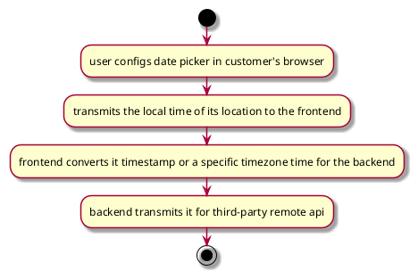

#

## Background
```
When I want to see the change failure rate and choose the date range in 9.20 - 9.21, but the data which has exported includes the date of 9.19.
```
The above content is [card](https://dorametrics.atlassian.net/jira/software/projects/ADM/boards/2?label=Stream1&selectedIssue=ADM-579)

## Analyse

### Reproduce
For what Card described, I tried to reproduce:

In backend code, class named `ChangeFailureRateCalculator`,it has a method named `calculate`,
it is the method responsible for calculating failure rate.
```java
public ChangeFailureRate calculate(List<DeployTimes> deployTimesList)
```

And when I use `San Francisco` timezone pick 9.20 - 9.21 in config page, the problem described by that card does not exist.

This way can discovered that there is indeed some data on 9.19.Here's same case between 7.18-7.19.
 
### Trace

This code is that get github's related info, included api `buildKiteFeignClient.getPipelineSteps`, `stepsParam.getStartTime()` and `stepsParam.getEndTime()`
are the standard UTC.  

```java
ResponseEntity<List<BuildKiteBuildInfo>> pipelineStepsInfo = buildKiteFeignClient.getPipelineSteps(realToken,
				orgId, pipelineId, page, perPage, stepsParam.getStartTime(), stepsParam.getEndTime(), branches);
```

We can get that when a user initiates a browser request from any region, the front-end code will be based on the user's special time zone.

In frontend code, class named `DateRangePicker`, we can debug this code, and tracking frontend transfers data to the backend.
```javascript
export const DateRangePicker = () => {
  const dispatch = useAppDispatch()
  const { startDate, endDate } = useAppSelector(selectDateRange)
  ······
}
```

In heartbeat config, metrics, report pages, frontend transmits timestamp or special timezone time to the backend.
This is what the browser gets based on the time zone after the user selects the time in the date picker,
such as:
```json
{
  "startTime": 1689609600000,
  "endTime": 1689811199999
}
```
or
```json
{
  "startTime": "2023-07-18T00:00:00.000+08:00",
  "endTime": "2023-07-19T23:59:59.999+00:00"
}
```
 
So we can get the date handler logic:


 
### Result
According to the analysis of the code, the logic of the system is that,
the time selected by the date picker is passed to the backend according to the user's time zone,
then the backend passes it to the third-party api.

The logic of our system is that the time selected by the user through the date picker can cover the Jira, Buildkite,
and GitHub data corresponding to the local time of the region.

There is a situation, when a user wants to get report about a time zone different from own browser,
there will be a certain gap. For example, if a user in China wants to get the report from 9.20 to 9.21 in Australia,
the data selected through the date picker will be biased.
