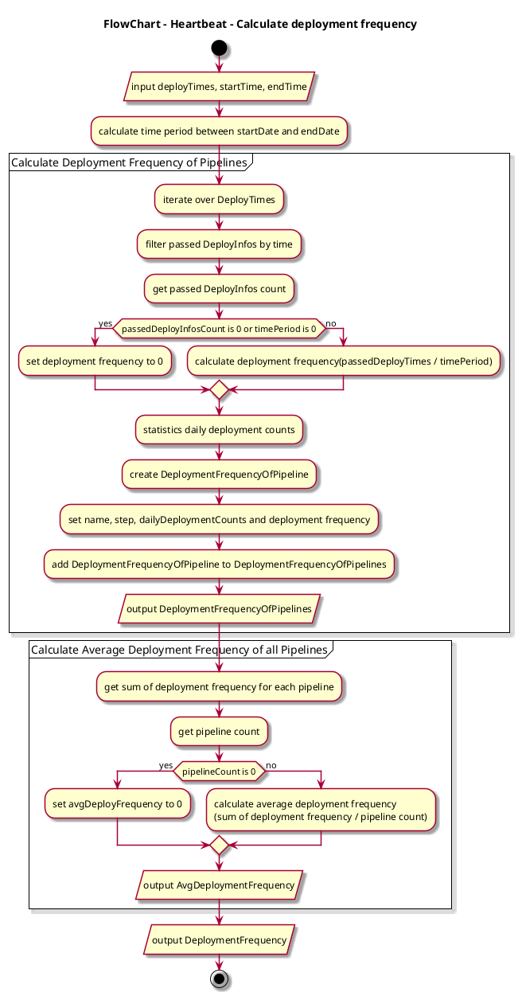

## Calculate Deployment Frequency

```plantuml
@startuml deployment frequency
skin rose
title FlowChart - Heartbeat - Calculate deployment frequency
start
:input deployTimes, startTime, endTime/
:calculate time period between startDate and endDate;
partition "Calculate Deployment Frequency of Pipelines" {
  :iterate over DeployTimes;
    :filter passed DeployInfos by time;
    :get passed DeployInfos count;
    if (passedDeployInfosCount is 0 or timePeriod is 0) then (yes)
      :set deployment frequency to 0;
    else (no)
      :calculate deployment frequency(passedDeployTimes / timePeriod);
    endif
    :statistics daily deployment counts;
    :create DeploymentFrequencyOfPipeline;
    :set name, step, dailyDeploymentCounts and deployment frequency;
    :add DeploymentFrequencyOfPipeline to DeploymentFrequencyOfPipelines;
  :output DeploymentFrequencyOfPipelines/
}
partition "Calculate Average Deployment Frequency of all Pipelines" {
  :get sum of deployment frequency for each pipeline;
  :get pipeline count;
  if (pipelineCount is 0) then (yes)
    :set avgDeployFrequency to 0;
  else (no)
    :calculate average deployment frequency
    (sum of deployment frequency / pipeline count);
  endif
  :output AvgDeploymentFrequency/
}
:output DeploymentFrequency/
stop
@enduml
```
