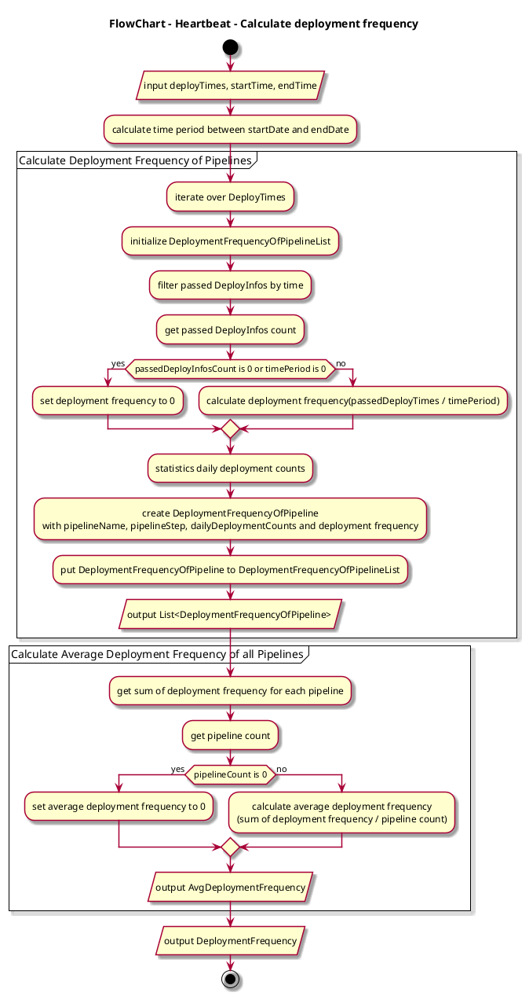
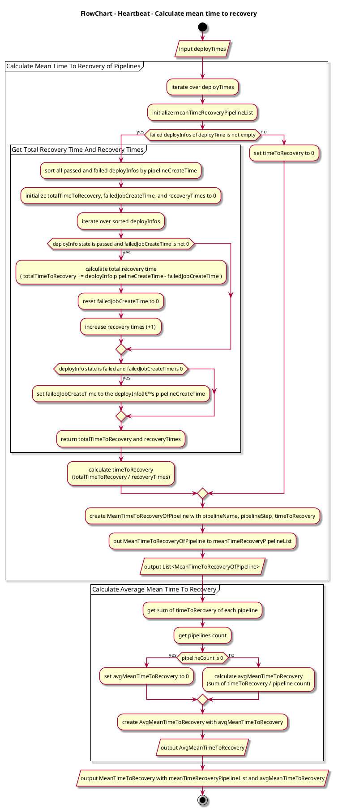
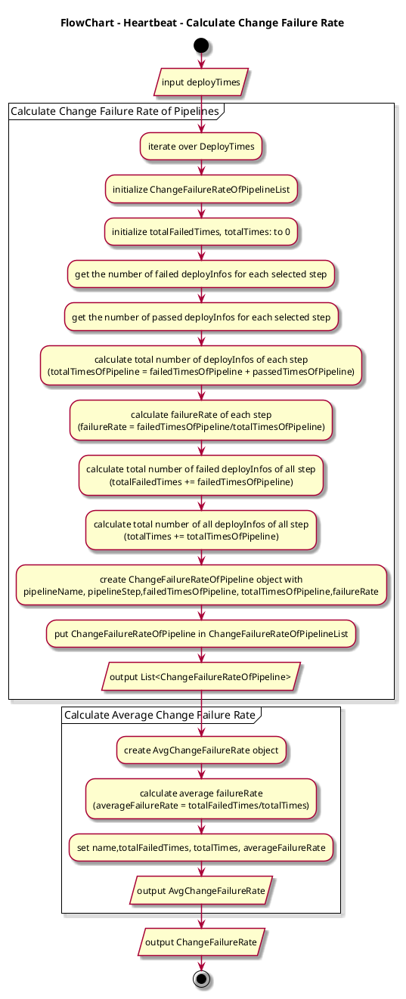

## Calculate Deployment Frequency

```plantuml
@startuml deployment frequency
skin rose
skinparam defaultTextAlignment center
title FlowChart - Heartbeat - Calculate deployment frequency
start
:input deployTimes, startTime, endTime/
:calculate time period between startDate and endDate;
partition "Calculate Deployment Frequency of Pipelines" {
  :iterate over DeployTimes;
  :initialize DeploymentFrequencyOfPipelineList;
    :filter passed DeployInfos by time;
    :get passed DeployInfos count;
    if (passedDeployInfosCount is 0 or timePeriod is 0) then (yes)
      :set deployment frequency to 0;
    else (no)
      :calculate deployment frequency(passedDeployTimes / timePeriod);
    endif
    :statistics daily deployment counts;
    :create DeploymentFrequencyOfPipeline
    with pipelineName, pipelineStep, dailyDeploymentCounts and deployment frequency;
    :put DeploymentFrequencyOfPipeline to DeploymentFrequencyOfPipelineList;
  :output List<DeploymentFrequencyOfPipeline> /
}
partition "Calculate Average Deployment Frequency of all Pipelines" {
  :get sum of deployment frequency for each pipeline;
  :get pipeline count;
  if (pipelineCount is 0) then (yes)
    :set average deployment frequency to 0;
  else (no)
    :calculate average deployment frequency
    (sum of deployment frequency / pipeline count);
  endif
  :output AvgDeploymentFrequency/
}
:output DeploymentFrequency/
stop
@enduml
```

## Calculate Mean Time To Recovery

```plantuml
@startuml mean time to recovery
skin rose
skinparam defaultTextAlignment center
title FlowChart - Heartbeat - Calculate mean time to recovery
start
:input deployTimes/
partition "Calculate Mean Time To Recovery of Pipelines" {
  :iterate over deployTimes;
  :initialize meanTimeRecoveryPipelineList;
    if (failed deployInfos of deployTime is not empty) then (yes)
      partition "Get Total Recovery Time And Recovery Times" {
        :sort all passed and failed deployInfos by pipelineCreateTime;
        :initialize totalTimeToRecovery, failedJobCreateTime, and recoveryTimes to 0;
        :iterate over sorted deployInfos;
          if (deployInfo state is passed and failedJobCreateTime is not 0) then (yes)
            :calculate total recovery time
            ( totalTimeToRecovery += deployInfo.pipelineCreateTime - failedJobCreateTime );
            :reset failedJobCreateTime to 0;
            :increase recovery times (+1) ;
          endif
          if (deployInfo state is failed and failedJobCreateTime is 0) then (yes)
            :set failedJobCreateTime to the deployInfo’s pipelineCreateTime;
          endif
        :return totalTimeToRecovery and recoveryTimes;
      }
      :calculate timeToRecovery
      (totalTimeToRecovery / recoveryTimes);
    else (no)
      :set timeToRecovery to 0;
    endif
  :create MeanTimeToRecoveryOfPipeline with pipelineName, pipelineStep, timeToRecovery;
  :put MeanTimeToRecoveryOfPipeline to meanTimeRecoveryPipelineList;
  :output List<MeanTimeToRecoveryOfPipeline> /
}
partition "Calculate Average Mean Time To Recovery" {
  :get sum of timeToRecovery of each pipeline;
  :get pipelines count;
  if (pipelineCount is 0) then (yes)
    :set avgMeanTimeToRecovery to 0;
  else (no)
    :calculate avgMeanTimeToRecovery
    (sum of timeToRecovery / pipeline count);
  endif
  :create AvgMeanTimeToRecovery with avgMeanTimeToRecovery;
  :output AvgMeanTimeToRecovery/
}
:output MeanTimeToRecovery with meanTimeRecoveryPipelineList and avgMeanTimeToRecovery/
stop
@enduml
```

## Calculate Change Failure Rate

```plantuml
@startuml Change Failure Rate
skin rose
skinparam defaultTextAlignment center
title FlowChart - Heartbeat - Calculate Change Failure Rate
start
:input deployTimes/
partition "Calculate Change Failure Rate of Pipelines" {
  :iterate over DeployTimes;
  :initialize ChangeFailureRateOfPipelineList;
  :initialize totalFailedTimes, totalTimes: to 0;
  :get the number of failed deployInfos for each selected step;
  :get the number of passed deployInfos for each selected step;
  :calculate total number of deployInfos of each step
  (totalTimesOfPipeline = failedTimesOfPipeline + passedTimesOfPipeline);
  :calculate failureRate of each step
  (failureRate = failedTimesOfPipeline/totalTimesOfPipeline);
  :calculate total number of failed deployInfos of all step
  (totalFailedTimes += failedTimesOfPipeline);
  :calculate total number of all deployInfos of all step
  (totalTimes += totalTimesOfPipeline);
  :create ChangeFailureRateOfPipeline object with
  pipelineName, pipelineStep,failedTimesOfPipeline, totalTimesOfPipeline,failureRate;
  :put ChangeFailureRateOfPipeline in ChangeFailureRateOfPipelineList;
  :output List<ChangeFailureRateOfPipeline> /
}
partition "Calculate Average Change Failure Rate" {
  :create AvgChangeFailureRate object;
  :calculate average failureRate
  (averageFailureRate = totalFailedTimes/totalTimes);
  :set name,totalFailedTimes, totalTimes, averageFailureRate;
  :output AvgChangeFailureRate/
}
:output ChangeFailureRate/

stop

@enduml
```
