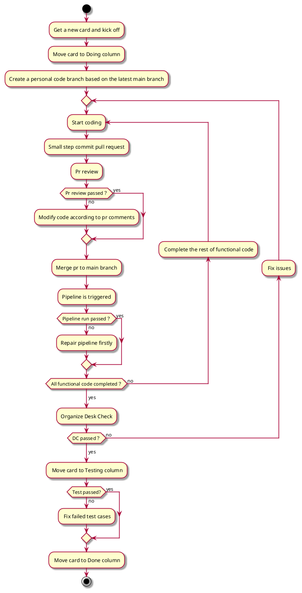

```plantuml
@startuml Way of Code Working
skin rose
start

:Get a new card and kick off;
:Move card to Doing column;
:Create a personal code branch based on the latest main branch;
  repeat
    repeat :Start coding;
      :Small step commit pull request;
      :Pr review;
      if(Pr review passed？) then (yes)
      else (no)
      :Modify code according to pr comments;
      endif
      :Merge pr to main branch;
      :Pipeline is triggered;
      if(Pipeline run passed？) then (yes)
      else(no)
        :Repair pipeline firstly;
      endif
    backward: Complete the rest of functional code;
    repeat while (All functional code completed？) is (no)
    ->yes;
    :Organize Desk Check;
  backward: Fix issues;
  repeat while (DC passed？) is (no)
  ->yes;
  : Move card to Testing column;
    if(Test passed?) then (yes)
    else(no)
    : Fix failed test cases;
    endif
  : Move card to Done column;

stop
@enduml
```
